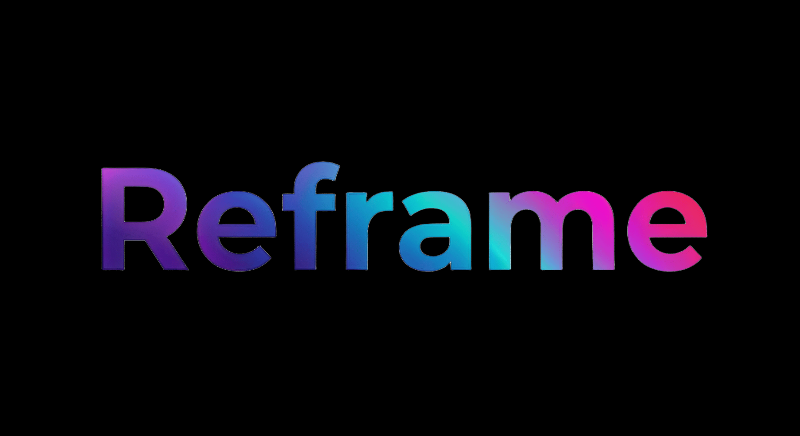

<h3 align="center">The Programmable Design Engine</h3>
<p align="center">
  
</p>
<p align="center">Parse · Validate · Transform · Export</p>

<p align="center">
  
  
  
  
  
  
  
</p>

<p align="center">
  <a href="#quick-start">Quick Start</a> · <a href="#mcp-pipeline">MCP Pipeline</a> · <a href="#inode--the-design-ast">INode AST</a> · <a href="#studio">Studio</a> · <a href="#how-its-different">Comparison</a> · <a href="#license">License</a>
</p>

---

<table>
<tr>
<td>

**🚀 v0.1.0 — Early Public Release**

The core engine is production-tested: HTML import, 19-rule audit with auto-fix, semantic resize, and 7 export formats all work. MCP pipeline powers AI agents in Claude Code, Cursor, and any MCP-compatible client. Studio is experimental. We're actively developing and welcome contributors.

</td>
</tr>
</table>

<br>

### Core Features

| | | |
|:---:|:---:|:---:|
| **🎨 Design AST** | **🤖 AI-Native Pipeline** | **⚡ Multi-Target Output** |
| INode — 80+ properties. Universal format for visual design. Open, portable, version-controlled. | 6 MCP tools. AI writes HTML, Reframe validates, adapts, exports. Works with any AI agent. | One design → HTML, React, SVG, PNG, Lottie, Animated HTML, Multi-page Site. |
| **✅ 19-Rule Audit** | **🔄 Deterministic Resize** | **👨‍🎨 Studio Editor** |
| Contrast, accessibility, brand compliance. Auto-fix most issues. Put in CI — bad designs don't ship. | Not scaling — re-layout. Classifies elements, remaps to guide templates. Milliseconds. No AI. | Open what AI created, edit visually — drag, resize, tweak properties. Same INode, same pipeline. |

---

## What is Reframe?

Reframe does for design what compilers do for code. An intermediate representation (**INode**), a validation layer (**19 audit rules**), an adaptation engine (**semantic resize**), and multi-target output.

```
┌─────────────────────────────────────────────────────────────┐
│                                                             │
│   IMPORT                                                    │
│   ──────                                                    │
│   AI Agent ─────→ HTML/CSS ───────────┐                     │
│   Designer ─────→ Studio (visual) ────┤                     │
│   Any App ──────→ adapter / API ──────┤                     │
│                                      ▼                      │
│                          ┌────────────────────┐             │
│                          │                    │             │
│                          │    INode AST       │             │
│                          │    SceneGraph      │             │
│                          │                    │             │
│                          │    @reframe/ui     │             │
│                          │    120 functions   │             │
│                          │    to build INode  │             │
│                          │    programmatically│             │
│                          │                    │             │
│                          └─────────┬──────────┘             │
│                                    │                        │
│   ENGINE                           │                        │
│   ──────               ┌───────────┼───────────┐           │
│                        ▼           ▼           ▼           │
│                   ┌─────────┐ ┌─────────┐ ┌─────────┐     │
│                   │  Audit  │ │ Resize  │ │ Tokens  │     │
│                   │19 rules │ │semantic │ │ design  │     │
│                   │auto-fix │ │re-layout│ │ system  │     │
│                   └────┬────┘ └────┬────┘ └────┬────┘     │
│                        └───────────┼───────────┘           │
│                                    ▼                        │
│   OUTPUT                                                    │
│   ──────                                                    │
│   .reframe/exports/*.html ········· static pages            │
│   .reframe/exports/*.tsx ·········· React components        │
│   .reframe/exports/*.svg ·········· vector graphics         │
│   .reframe/exports/*.json ········· Lottie animations       │
│   .reframe/exports/site.html ······ multi-page app          │
│   .reframe/scenes/*.scene.json ···· portable INode          │
│                                                             │
└─────────────────────────────────────────────────────────────┘
```

> **Any input. One AST. Any output.**  
> AI agents write HTML. Developers write TypeScript. Designers use Studio. Apps integrate via adapters. All produce INode — the engine validates, adapts, and exports to any format.

---

## Why

Design has no compiler. Code has GCC, ESLint, Prettier, TypeScript — tools that parse, validate, transform, and output. Design has Figma (proprietary), Photoshop (opaque), and HTML (mixes structure with style).

**Reframe is the missing layer.**

```
  PARSE        any design → structured data (INode AST)
  VALIDATE     19 rules: contrast, accessibility, brand. Auto-fix.
  TRANSFORM    resize, tokens, dark mode, responsive
  OUTPUT       → HTML, React, SVG, PNG, Lottie, Animated, Site
```

> Put `reframe build` in CI — designs that violate brand guidelines don't ship.

---

## Data Flow

```
  ┌──────────────────────────────────────────────────────────┐
  │ 1. IMPORT                                                │
  │    AI Agent ──→ HTML/CSS ───┐                            │
  │    Designer ──→ Studio ─────┤──→ INode AST              │
  │    Any App ───→ adapter ────┘    (80+ properties)        │
  │                                                          │
  │ 2. ENGINE                                                │
  │    Audit ···· 19 rules, auto-fix                         │
  │    Resize ··· semantic re-layout                         │
  │    Tokens ··· DESIGN.md → CSS vars, dark mode            │
  │                                                          │
  │ 3. EXPORT                                                │
  │    .reframe/exports/*.html ······ static pages           │
  │    .reframe/exports/*.tsx ······· React components       │
  │    .reframe/exports/*.svg ······· vector graphics        │
  │    .reframe/exports/*.json ······ Lottie animations      │
  │    .reframe/exports/site.html ··· multi-page app         │
  │    .reframe/scenes/*.scene.json · portable INode         │
  └──────────────────────────────────────────────────────────┘
```

---

## Quick Start

### For AI Agents — MCP

Add to your MCP client config (Claude Code, Cursor, Windsurf, Cline):

```json
{
  "mcpServers": {
    "reframe": {
      "command": "node",
      "args": ["node_modules/@reframe/mcp/dist/mcp/src/index.js"]
    }
  }
}
```

**The pipeline:**

```
1. reframe_design({ brand: "stripe" })                        → load brand
2. reframe_compile({ html: "<div>...</div>" })                 → AI writes HTML → INode
3. reframe_inspect({ sceneId: "s1" })                          → audit (REQUIRED)
4. reframe_edit({ operations: [{ op: "update", ... }] })       → fix issues
5. reframe_export({ sceneId: "s1", format: "site" })           → export
```

AI writes creative HTML. Reframe handles validation, brand compliance, and multi-format export.

### For Developers — @reframe/ui

120 composable TypeScript functions that build INode trees. The programmatic API to the same AST that MCP and Studio use.

```typescript
import { render, page, stack, row, heading, body, button, card } from '@reframe/ui';

const primary = '#7c3aed';
const plans = [
  { name: 'Free', price: '$0', features: ['5 projects', 'Community support'] },
  { name: 'Pro', price: '$29', features: ['Unlimited', 'Priority support', 'API'] },
];

const html = await render(
  page({ w: 1440 },
    stack({ pad: [140, 80], gap: 32, align: 'center', fills: ['#09090b'] },
      heading('Simple pricing', { fontSize: 48, fills: ['#fafafa'] }),
      row({ gap: 24, justify: 'center' },
        ...plans.map(p => card({ layoutGrow: 1, pad: 32, gap: 16, fills: ['#111'] },
          heading(p.name, { level: 3, fills: ['#fafafa'] }),
          heading(p.price, { level: 2, fills: [primary] }),
          ...p.features.map(f => body(`✓ ${f}`, { fontSize: 14, fills: ['#a1a1aa'] })),
          button('Get started', { variant: 'filled', color: primary }),
        )),
      ),
    ),
  ),
);
```

> **This is what makes it programmable** — variables, loops, conditionals, themes.  
> Figma can't loop. HTML can't be validated. `@reframe/ui` is code that produces verified design.

### For CI/CD

```yaml
# .github/workflows/design.yml
- run: npx reframe build   # compile all scenes from config
- run: npx reframe test    # assert design rules pass
```

---

## INode — The Design AST

INode is to visual design what the DOM is to documents — a universal, structured representation. Every visual tool uses the same primitives. INode makes them explicit and programmable.

```typescript
interface INode {
  // Identity
  type: 'FRAME' | 'TEXT' | 'RECTANGLE' | 'ELLIPSE' | 'GROUP' | 'VECTOR';
  name: string;

  // Geometry
  x, y, width, height, rotation: number;

  // Visual
  fills: Paint[];              // solid, gradient, image
  strokes: Paint[];            // borders
  effects: Effect[];           // drop shadow, inner shadow, blur
  cornerRadius: number;
  opacity: number;

  // Layout (CSS Flexbox + Grid)
  layoutMode: 'HORIZONTAL' | 'VERTICAL' | 'GRID' | 'NONE';
  primaryAxisAlign: 'MIN' | 'CENTER' | 'MAX' | 'SPACE_BETWEEN';
  counterAxisAlign: 'MIN' | 'CENTER' | 'MAX' | 'STRETCH';
  itemSpacing: number;
  padding: { top, right, bottom, left };
  layoutGrow: number;          // flex-grow

  // Typography
  characters: string;
  fontSize, fontWeight: number;
  fontFamily: string;
  lineHeight, letterSpacing: number;
  styleRuns: StyleRun[];       // rich text

  // Behavior
  states: { hover: {...}, active: {...}, focus: {...} };
  responsive: [{ maxWidth: 768, props: { fontSize: 28 } }];

  // Semantic
  semanticRole: 'button' | 'heading' | 'nav' | 'hero' | 'cta';
  href: string;                // navigation target
}
```

**Adapters** bridge INode to external tools. The Standalone adapter runs headless (Node.js, MCP, CI). The Figma adapter maps INode ↔ SceneNodes. Write an adapter (~200 lines) and any design tool speaks the same language.

---

## MCP Pipeline

6 tools. Continuous feedback loop — not a linear pipeline.

```
compile → inspect → [edit → inspect]* → export → user reviews
                                                       │
            ↑          "make the CTA bigger"           │
            └──────────────────────────────────────────┘
            edit → inspect → export → user reviews again
```

| Tool | Purpose |
|------|---------|
| `reframe_design` | Load brand or extract from URL/HTML. Sets session context |
| `reframe_compile` | AI writes HTML → import to INode. Auto-audit + auto-fix |
| `reframe_inspect` | Tree + 19-rule audit + **actionable fix suggestions** |
| `reframe_edit` | Fix issues — inspect tells you exactly what to change |
| `reframe_export` | Preview: html, react, svg, lottie, animated_html, site |
| `reframe_project` | Save/load. Scenes persist to `.reframe/scenes/` |

Export is not the final step — it's a **preview**. User sees the result, gives feedback, AI edits, inspects, exports again. The loop continues until the user is happy.

Inspect gives **edit commands**, not just errors:
```
[!] contrast 2.57:1 for "Product"
    → reframe_edit: update "Product" props: { fills: ["#fafafa"] }
```

### Multi-Page Sites

```
reframe_compile({ html: "...", name: "home" })
reframe_compile({ html: "...", name: "pricing" })
reframe_compile({ html: "...", name: "about" })
reframe_export({ sceneId: "s1", format: "site" })
```

> Produces a single HTML file: hash routing, page transitions, auto-linked navigation, active nav state.

---

## DESIGN.md — Brand as Code

Not a config file — a **design philosophy** in markdown. Teaches AI agents and humans how to design in your brand.

```markdown
# Stripe

## Visual Atmosphere
Weight 300 at display sizes is Stripe's most distinctive choice.
The text doesn't need to shout.

## Colors
| Role | Value |
|------|-------|
| primary | #533afd |
| text | #061b31 |

## Do's and Don'ts
- DO use weight 300 for headlines — lightness is luxury
- DON'T use border-radius > 8px — conservative is intentional
- DO use blue-tinted shadows — rgba(50,50,93,0.25)
```

Pre-built brand guides available. Extract from any website or load by name.

Extract from any website: `reframe_design({ url: "https://example.com" })`

---

## Audit Engine

19 rules across 5 categories. Most auto-fix.

| Category | Rules | Auto-fix |
|----------|-------|:--------:|
| **Accessibility** | contrast-minimum (WCAG AA), min-touch-target (44px), min-font-size | ✓ |
| **Structural** | text-overflow, node-overflow, no-empty-text, no-zero-size, no-hidden-nodes | partial |
| **Brand** | font-in-palette, color-in-palette, font-weight, font-size-role, border-radius, spacing-grid | ✓ |
| **Design Quality** | visual-hierarchy, content-density, visual-balance, cta-visibility | — |
| **Export** | export-fidelity | — |

---

## Universal Resize

> **In development.** Functional for standard formats, improving continuously.

Deterministic layout adaptation — no AI, no guessing. The engine classifies elements by role, detects layout patterns, and remaps content to target dimensions using guide templates.

```
1920×1080 hero  →  classify (title, button, background)
                →  detect pattern (full_bleed_hero)
                →  select guide (728×90 template)
                →  remap elements to slots
                →  728×90 banner — re-composed, not scaled
```

One design → banner, social card, story, OG image. Milliseconds. Pure computation — deterministic, reproducible, no LLM needed.

---

## Studio

> **Experimental** — functional, under active development.

Visual editor for INode. Drag, resize, edit properties by hand, see changes live. What AI creates through MCP — designers can open, tweak visually, and export from the same pipeline.

```
┌───────────────────────────────────────────────────────┐
│                                                       │
│  AI creates via MCP          Designer edits in Studio │
│        │                              │               │
│        ▼                              ▼               │
│  ┌──────────┐    real-time sync   ┌──────────┐       │
│  │          │◄────── SSE ────────►│  Canvas  │       │
│  │  INode   │    (port 4100)      │  Layers  │       │
│  │  AST     │                     │  Props   │       │
│  │          │                     │  Audit   │       │
│  └────┬─────┘                     └──────────┘       │
│       │                           drag, resize,       │
│       ▼                           edit fills/text/    │
│  same audit                       spacing/effects     │
│  same export                      by hand             │
│  same pipeline                                        │
│                                                       │
└───────────────────────────────────────────────────────┘
```

```bash
cd packages/studio && npm run dev   # → http://localhost:3000
```

| Feature | Status |
|---------|--------|
| Visual canvas — drag, resize, select | ✓ |
| Layers panel — tree view, reorder | ✓ |
| Properties panel — edit fills, text, spacing, effects | ✓ |
| Real-time MCP sync (SSE) | ✓ |
| Scene management | ✓ |
| Audit panel — see issues inline | ✓ |
| Headless preview without Studio (port 4100) | ✓ |

Studio is optional — the engine works headless. But when you need to see and touch the design, Studio is there.

---

## Animation

> **Beta** — functional, actively improving.

23 presets + custom keyframes + spring physics. Export as CSS animations or Lottie JSON.

```
reframe_export({
  sceneId: "s1",
  format: "animated_html",
  animate: {
    presets: [
      { nodeName: "Headline", preset: "fadeSlideUp", delay: 0 },
      { nodeName: "CTA", preset: "scaleIn", delay: 400 }
    ]
  }
})
```

<details>
<summary><strong>All 23 presets</strong></summary>

`fadeIn` · `fadeOut` · `slideInUp` · `slideInDown` · `slideInLeft` · `slideInRight` · `scaleIn` · `scaleOut` · `popIn` · `bounce` · `revealLeft` · `revealUp` · `pulse` · `shake` · `typewriter` · `colorShift` · `blurIn` · `fadeSlideUp` · `fadeSlideDown` · `fadeSlideLeft` · `fadeSlideRight` · `fadeScaleIn`

Stagger support for sequential animations across multiple elements.

</details>

---

## @reframe/ui — Standard Library

120 TypeScript functions. The programmatic interface to INode.

<details>
<summary><strong>Full function reference</strong></summary>

| Module | Count | Functions |
|--------|:-----:|-----------|
| Layout | 9 | `page` `stack` `row` `center` `wrap` `grid` `spacer` `container` `overlay` |
| Text | 8 | `heading` (h1-h6) `body` `label` `caption` `display` `mono` `divider` `image` |
| Interactive | 6 | `button` `link` `input` `select` `toggle` `navItem` |
| Containers | 8 | `card` `badge` `chip` `tag` `avatar` `stat` `quote` `listItem` |
| Data | 5 | `table` `tabs` `accordion` `progress` `keyValue` |
| Navigation | 4 | `sidebar` `breadcrumb` `pagination` `stepper` |
| Feedback | 6 | `modal` `toast` `tooltip` `alert` `banner` `emptyState` |
| Forms | 5 | `checkbox` `radio` `slider` `formGroup` `searchInput` |
| Sections | 9 | `heroSection` `featureGrid` `pricingSection` `testimonialSection` `ctaSection` `footerSection` `navbarSection` `logoBar` `statsBar` |
| Theme | 3 | `createTheme` `themed` `fromDesignMd` |
| Render | 2 | `render` `renderAll` |

</details>

---

## How It's Different

Reframe is not a replacement for design tools — it's infrastructure that sits between creation and production.

| What you get | How |
|-------------|-----|
| **Open format** | INode AST — not proprietary, not locked to any editor |
| **Automated QA** | 19 audit rules with auto-fix. Runs in CI. |
| **Multi-format export** | One design → 7 formats (HTML, React, SVG, PNG, Lottie, animated, site) |
| **AI-native pipeline** | MCP tools — any AI agent can design, validate, export |
| **Brand compliance** | DESIGN.md = brand philosophy. Audit enforces it. |
| **Deterministic resize** | Semantic re-layout — no AI, pure computation |
| **Design as code** | Version-controlled, testable, composable |

> **The analogy:** ESLint doesn't replace your editor — it validates your code. Reframe doesn't replace your design tool — it validates, adapts, and exports your design.

---

## Architecture

```
packages/
│
├── core/       @reframe/core
│               INode AST · SceneGraph · layout engine (Yoga WASM)
│               audit (19 rules) · importers (HTML, Figma)
│               exporters (HTML, SVG, React, Lottie, animated, site)
│               @reframe/ui (120 functions) · design system · resize engine
│               animation (23 presets) · semantic layer · diff · assert
│
├── mcp/        @reframe/mcp
│               MCP server (6 tools) · HTTP sidecar (port 4100)
│               session management · brand library · auto-fix engine
│
├── cli/        @reframe/cli
│               `reframe build` · `reframe test` · config loader · Figma import
│
└── studio/     @reframe/studio  (experimental)
                Visual editor (React + Vite) · canvas · layers panel
                Properties panel · real-time MCP sync via SSE
```

---

## Install

**Requirements:** Node.js >= 18

```bash
git clone https://github.com/ilya-makarov-dev/reframe.git
cd reframe
npm install
npm run build
npm test
```

> npm packages (`@reframe/core`, `@reframe/mcp`, `@reframe/cli`) are not yet published to npm. Install from source for now.

---

## Contributing

Contributions welcome.

1. Fork and create a feature branch
2. Make changes with tests
3. `npm test` to verify
4. Submit a PR

By submitting a contribution, you agree that your work is licensed under the project's AGPL-3.0 license and that the project maintainer retains the right to relicense contributions under the commercial license. See [CLA.md](CLA.md).

Active contributors who make significant, sustained contributions may be invited as **core contributors** with commit access and a role in the project's direction.

**Areas where help is needed:**

- **Export targets** — SwiftUI, Flutter, Jetpack Compose, MJML (email)
- **Audit rules** — new design quality and accessibility checks
- **Brand guides** — extract and contribute DESIGN.md for popular brands
- **HTML importer** — CSS property coverage, CSS Grid, complex selectors
- **Studio** — canvas performance, property editing, undo/redo
- **Adapters** — Sketch, Penpot, Canva

---

## License

<table>
<tr>
<td width="50%">

**Open Source — AGPL-3.0**

Free for open source. Use, modify, distribute — as long as your source is available under the same terms when deployed as a network service.

</td>
<td width="50%">

**Commercial License**

For closed-source SaaS, proprietary software, or managed services where AGPL doesn't work.

[Details →](COMMERCIAL_LICENSE.md)

</td>
</tr>
</table>

---

<p align="center">
  Created by <a href="https://github.com/ilya-makarov-dev">Ilya Makarov</a>
</p>
