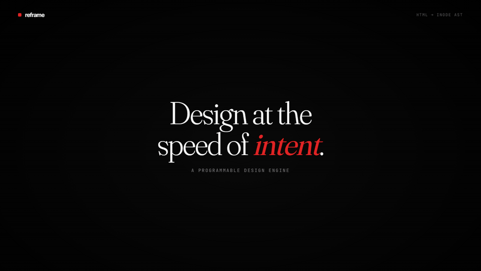

<h1 align="center">reframe</h1>

<p align="center">
  <b>AI-native design engine.</b> Design anything — pages, decks, motion, video.
</p>

<p align="center">
  <b>Open-source alternative to Figma & Claude Design.</b>
</p>

<p align="center">
  <sub>
    Claude Code inside the canvas · no switching · your subscription (Codex coming)<br>
    Cursor / Cline / any MCP client via external connection
  </sub>
</p>

<p align="center">
  
  
  
  
  
  
  
</p>

<p align="center">
  
</p>

<p align="center">
  <sub><b>✦ Created in reframe ✦</b> &nbsp;·&nbsp; every pixel above authored end-to-end by the pipeline reframe ships with</sub>
</p>

<br>

reframe is an open-source design tool built for the era where agents write UI and humans direct it. Instead of opaque vector graphs (Figma) or proprietary runtimes (Framer), reframe works on **HTML + INode AST** — the same language your browser already speaks. Every surface is structured content; every structure is editable, auditable, exportable, animatable, renderable.

## How this demo was made

The GIF above wasn't screen-recorded — it was **authored end-to-end by reframe itself.** A three-line brief to the agent:

> *"Make a demo of reframe — 3 sites on one canvas, pick a cool brand, sell the product."*

What the agent did:

- **Loaded Ferrari's design system** — editorial chiaroscuro, Ferrari Red accent, FerrariSans, 2px radius
- **Wrote one scene with three frames** side-by-side — Hero · Lineup · Performance
- **Compiled** → INode AST, 32-rule audit PASS, 83% aesthetic score, zero errors
- **Captured** → Playwright snapped 175 frames → ffmpeg stitched → 1.25 MB GIF

All reproducible. Swap Ferrari for any of the 60+ brands in the catalog, re-run the capture scripts — different brand, different demo, **zero new code written.**

```
  ╔═══════════════════════════════════════════════════════════════════════════════╗
  ║  reframe platform                              /platform/project/:slug :4100  ║
  ║                                                                               ║
  ║  ┌─ LAYERS ────┐  ┌─ CANVAS ─────────────────────────────┐  ┌─ PROPS ───┐     ║
  ║  │             │  │  ┌────────────────────────────────┐  │  │           │     ║
  ║  │ ▸ Row       │  │  │                                │  │  │ Fill      │     ║
  ║  │   ▸ Hero    │  │  │   Live HTML in iframe — real   │  │  │ #FF2800   │     ║
  ║  │     Title   │  │  │   CSS, video, forms, motion    │  │  │           │     ║
  ║  │     CTA     │  │  │   drag · resize · inline-edit  │  │  │ Font      │     ║
  ║  │   ▸ Grid    │  │  │                                │  │  │ Inter/700 │     ║
  ║  │   ▸ Footer  │  │  └────────────────────────────────┘  │  │           │     ║
  ║  │             │  │  ◀ ▶ timeline scrub                  │  │ Audit     │     ║
  ║  │             │  │                                      │  │ ✓ 94/100  │     ║
  ║  │             │  │  ┌─ chat (lives inside canvas) ────┐ │  │           │     ║
  ║  │             │  │  │ "rebrand to Linear, dim hero"   │ │  │           │     ║
  ║  │             │  │  │ › running reframe_design …      │ │  │           │     ║
  ║  │             │  │  └─────────────────────────────────┘ │  │           │     ║
  ║  └─────────────┘  └──────────────────────────────────────┘  └───────────┘     ║
  ╚═══════════════════════════════════════════════╤═══════════════════════════════╝
                                                  │
               ┌──────────────────────────────────┼──────────────────────────────┐
               │                                                                 │
  ┌────────────▼────────────┐                                ┌──────────────────▼──────────────┐
  │  External agent         │ connects via MCP (stdio)       │  Built-in platform agent        │
  │                         │ ──────────────────────────►    │                                 │
  │  Claude Code · Cursor   │                                │  local spawn, no API            │
  │  any MCP-compatible     │                                │  (subscription, in-chat)        │
  │  client                 │                                │                                 │
  └────────────┬────────────┘                                └──────────────────┬──────────────┘
               └─────────────────────────┬───────────────────────────────────────┘
                                         │  both routes share the same contract
                                         ▼
               ╔═════════════════════════════════════════════════════════╗
               ║                  glue — reframe-aware agent             ║
               ║  · CLAUDE.md         project rules + architecture        ║
               ║  · 7 skills          taste + smell tables (.claude/)     ║
               ║  · 7 MCP tools       the verbs the agent can speak       ║
               ╚═══════════════════════════════╤═════════════════════════╝
                                               │
                                               ▼
               ┌──────────────────────────────────────────────────────────┐
               │                                                          │
               │                    INode  SceneGraph                     │
               │                                                          │
               │   typed tree · layout · tokens · states · motion · audit │
               │                                                          │
               │   one source of truth — what the agent writes,           │
               │   what the canvas renders, what every exporter reads     │
               │                                                          │
               └──────┬─────────┬─────────┬─────────┬─────────┬──────┬────┘
                      ▼         ▼         ▼         ▼         ▼      ▼
                    HTML      React     SVG       PNG      Lottie   MP4
                   + GSAP    (4 stacks) PDF                      (hyperframes)
```

## Quick Start

### Option 1: With an AI coding agent (recommended)

Any MCP-compatible agent (Claude Code, Cursor, any client that speaks MCP):

```bash
git clone https://github.com/ilya-makarov-dev/reframe.git
cd reframe
npm install && npm run build
npm start                                      # :4100/platform — live canvas + MCP endpoint
```

Open your agent, say:

```
Design a Linear-inspired pricing page with 3 tiers, compare-badge on the middle tier,
and a hover-lift CTA. Use tokens — no raw hex.
```

The agent calls `reframe_design extract brand=linear` → `reframe_compile` → `reframe_inspect` → `reframe_edit` for polish → `reframe_export format=react`. You watch the scene render live at `:4100/platform/project/<slug>` while it works. Every tool returns an inline PNG preview so multimodal models see what they just built.

### Option 2: Drive the CLI directly

```bash
reframe init my-site && cd my-site
reframe compile home.html --name home          # HTML → INode (auto-audit, auto-fix, token bind)
reframe audit --scene home                     # 37-rule + 8 aesthetic score
reframe export --scene home --format react     # or html | svg | png | pdf | lottie | video
```

**Requirements:** Node.js ≥ 18. FFmpeg + Chrome only when you render to `video`.

### Try it: example prompts

- **Cold start** — *"Design a Ferrari-branded landing hero with a scroll-snap feature list and an Express-checkout in dark."*
- **Rebrand in place** — *"Switch this from Stripe to Linear without restructuring — tokens + typography only."*
- **Composable** — *"Paste this HTML, audit WCAG contrast + brand fidelity, fix failures, export as React + css-modules."*
- **Motion** — *"Add a fade-in hero reveal and a stagger on the feature cards. Export as 5-second MP4 via hyperframes."*
- **Multi-page** — *"Build home + pricing + 404 with shared nav and cross-page transitions. Keep the brand frozen."*

See [CLAUDE.md](./CLAUDE.md) for the skill-layer playbook each agent runs.

---

## Why reframe

```
┌─────────────────────────────────────────────────────────────────────┐
│                                                                     │
│   Figma      ▸  opaque vector graph  ▸  export = image or rough     │
│                                                                     │
│   Framer     ▸  proprietary runtime  ▸  lock-in at deploy           │
│                                                                     │
│   Webflow    ▸  visual-only          ▸  no AI surface               │
│                                                                     │
│   reframe    ▸  HTML + INode AST     ▸  any output, determinstic    │
│                                          ▸  AI speaks the format    │
│                                                                     │
└─────────────────────────────────────────────────────────────────────┘
```

- **AST over pixels.** INode is a typed tree — 50+ semantic fields (layout, tokens, states, responsive, animation). AI edits structure, not bitmaps. Same input = identical output, no temperature roulette.
- **Browser-native canvas.** The editor renders scenes as real HTML in an iframe. CSS animations, video, form controls — all work natively. No WASM boot. No Skia divergence. 32.8 KB editor bundle.
- **Agent-first surface.** 7 MCP tools + 7 role-framed skills. Every mutation goes through one graph; every state ships to 7 formats deterministically.
- **37-rule audit + 8 aesthetic metrics + brand fidelity.** The engine measures contrast, overflow, alignment, whitespace, hierarchy, rhythm, radius compliance, token usage — returns auto-fix recipes.
- **Skill layer carries taste.** The audit measures structure; skills catch slop. Smell tables grow session-over-session: genericness, fake content, fake logos, tone mismatch, 3-equal-cards, gradient inflation — caught in seconds instead of rediscovered.
- **Open source under AGPL-3.0.** No per-render fees. No seat caps. Fork, redistribute, adapt.

---

## How It Works

One input → one graph → many outputs. No bridges, no two-way syncs, no runtime divergence:

```
  ┌──────────────────┐  ┌──────────────────┐  ┌──────────────────┐
  │  DESIGN.md spec  │  │  HTML (file /    │  │   Direct canvas  │
  │  (60+ brands)    │  │  paste / URL)    │  │   edit (drag,    │
  │                  │  │                  │  │   text, resize)  │
  └────────┬─────────┘  └────────┬─────────┘  └────────┬─────────┘
           │                     │                     │
           └─────────────────────┴─────────────────────┘
                                 │
                                 ▼
               ┌─────────────────────────────────────┐
               │                                     │
               │          INode SceneGraph           │
               │                                     │
               │   · typed tree of design nodes      │
               │   · Yoga-backed flex + grid layout  │
               │   · DTCG token bindings             │
               │   · ITimeline (keyframes per node)  │
               │   · semantic roles + slots          │
               │                                     │
               │   measured by:                      │
               │   ─ 37 audit rules                  │
               │   ─ 8 aesthetic metrics             │
               │   ─ brand fidelity vs DESIGN.md     │
               │                                     │
               └──────────────────┬──────────────────┘
                                  │
     ┌────────────┬───────────────┼───────────────┬────────────┐
     ▼            ▼               ▼               ▼            ▼
  ┌──────┐   ┌──────┐         ┌──────┐        ┌──────┐     ┌──────┐
  │ HTML │   │ React│         │ SVG  │        │Lottie│     │Video │
  │+ GSAP│   │ TSX  │         │PNG   │        │(JSON)│     │(MP4) │
  │      │   │      │         │PDF   │        │      │     │      │
  └──────┘   └──────┘         └──────┘        └──────┘     └──────┘
```

**INode is to design what AST is to code.** The editor is the only place in the system where pixels exist — every other surface (audit, rebrand, export, version-control, agent tool call) operates on the typed tree.

---

## The 7 MCP Tools

| Tool              | What it does                                                         |
|---                |---                                                                   |
| `reframe_design`  | Brand + catalog. Load 60+ DESIGN.md systems (Stripe, Linear, Airbnb, Ferrari, Vercel, Apple, GitHub, Notion…) via `getdesign` npm. Browse the hyperframes motion-block catalog. Reverse-engineer any URL into a DESIGN.md. |
| `reframe_compile` | HTML → INode. Auto-audit, auto-fix, token binding. Returns PNG preview so multimodal models see the result. |
| `reframe_inspect` | Tree walk + 37-rule audit + 8 aesthetic metrics + brand fidelity score + diff vs another scene. |
| `reframe_edit`    | Every mutation — update props / add / delete / clone / move / resize / macros (scale spacing, rotate colors, typography preset, corner radius stack) / components / variations grid (Cartesian of brand × density × radius × typography) / addBlock (install hyperframes catalog motion block as INode subtree). |
| `reframe_export`  | 7 formats: `html` (optionally animated) / `react` (inline / css-modules / tailwind / styled-components) / `svg` / `png` / `pdf` / `lottie` / `video` (MP4 via hyperframes render). |
| `reframe_project` | Persistence — save/load scenes, brand registry, component library, macros, variants, history replay. |
| `reframe_ui`      | Playwright-backed Platform UI automation. Stateful sessions. Reproduce bugs, verify fixes, walk multi-step flows end-to-end in a real browser. |

## The 7 Skills

Agents don't just call tools — they run role-framed skills with smell-table memory:

| Skill              | Role                                                                        |
|---                 |---                                                                          |
| `reframe-design`   | Write HTML with taste rules baked in. Anti-slop patterns + smell table.     |
| `reframe-brand`    | Brand translation — vibe → tokens. Parser auto-diff for drift detection across 60+ brands. |
| `reframe-critic`   | ≤3-item review with engine citations. Translates metrics → designer language. |
| `reframe-enhance`  | Vague ask → structured brief. Required before site-loop or debug orchestration. |
| `reframe-site-loop`| Multi-page site, baton pattern, brand frozen on turn 1, cross-page nav wired. |
| `reframe-to-react` | Scene → TSX. Stack choice baked in; byte-deterministic exports.             |
| `designer-qa`      | The orchestrator. Debugs across engine · UI · export · brand · taste · tests. |

Smell tables GROW. Each session catches failure patterns the 37-rule audit can't encode (genericness, centered-hero-with-5-elements, fake metrics, fake logos, brand type weight collapse, 3-equal-cards, gradient inflation, corner inflation). Next session catches the same pattern in seconds instead of rediscovering it. That's the moat — the engine is deterministic, skills are the memory the engine lacks.

---

## Structure + Motion + Presentation = one graph

```
┌───────────────────────────┬──────────────────────────┬─────────────────────┐
│                           │                          │                     │
│    STRUCTURE              │    MOTION                │    PRESENTATION     │
│                           │                          │                     │
│    INode tree             │    ITimeline             │    Present mode     │
│    · flex + grid          │    · keyframes per node  │    · CSS 3D camera  │
│    · typography           │    · GSAP-compatible     │    · filter stack   │
│    · tokens               │    · ms → s @ render     │    · 5 presets      │
│    · states (:hover…)     │    · frame-accurate      │      tilt/fly/iso   │
│    · responsive (@media)  │      scrub via           │      /parallax      │
│    · semantic roles       │      window.__timelines  │    · 6 filters      │
│                           │                          │      cinema/noir    │
│                           │                          │      /dream/neon    │
│                           │                          │      /crt           │
│                           │                          │                     │
└───────────────────────────┴──────────────────────────┴─────────────────────┘
                                       │
                                       ▼
                            Exports read all three
                            · html + GSAP uses motion
                            · video render uses all three (camera + timeline + DOM)
                            · static formats ignore motion / presentation
```

The same scene is:
- A **design** at rest (what you ship as HTML)
- A **motion piece** over time (what you export as GSAP-embedded HTML, Lottie, or MP4)
- A **presentation surface** in 3D space (what you show a client via present mode or cinematic MP4)

No separate files. No conversion. No fidelity loss between the three.

---

## Video pipeline

reframe + [hyperframes](https://github.com/heygen-com/hyperframes) compose for MP4 / WebM export — your INode scene + ITimeline render to video via Puppeteer + FFmpeg, frame-accurate, out-of-process:

```
reframe_export({ sceneId, format: 'video', renderVideo: true, videoFps: 30 })
         │
         ▼
  exportToHyperframes(graph, rootId, { timeline })
         │  (builds HTML with GSAP master-timeline registered
         │   on window.__timelines[<id>] for frame scrubbing)
         ▼
  <slug>-video/index.html  ←  composition dir
         │
         ▼
  npx hyperframes render <dir> -o <slug>.mp4 --fps 30
         │  (spawned by reframe_export when renderVideo: true)
         ▼
  out.mp4
```

Motion-block catalog is installable as INode subtrees: `reframe_edit op=addBlock blockName=flash-through-white parentId=<node>`. The block passes through our HTML importer (pseudo-class states + @media + grid-auto-rows preserved) and becomes editable content — not an opaque embed.

---

## Figma interop

reframe doesn't ship a `.fig` binary parser in the browser. Two adapter routes instead:

- **Today** — Use Figma's *Copy as HTML* plugin → paste into `reframe_compile`. Richer than generic `.fig` parsers because it honors tokens, hover states, responsive rules, pseudo-class styling.
- **Tomorrow** — A dedicated `figma-import` adapter is on the roadmap. Server-side REST API walker that maps Figma's Auto-layout into INode flex + grid + tokens. Clean boundary; Figma plugins stay at their layer.

---

## Packages

| Package            | What's inside                                                              |
|---                 |---                                                                         |
| `@reframe/core`    | Engine — INode AST, Yoga-backed layout, 37-rule audit, tokens (DTCG-compatible), resize, variations, animation, 7 exporters |
| `@reframe/editor`  | Browser canvas — iframe + HTML exporter + CSS 3D transforms, selection overlays, zoom/pan, drag/resize/inline edit, present mode, incremental DOM patch on SSE |
| `@reframe/mcp`     | MCP server — 7 tools + Platform UI (`:4100`) + REST API + SSE sync         |
| `@reframe/cli`     | CLI — `reframe init / build / compile / audit / export / test`             |

---

## Install

```bash
git clone https://github.com/ilya-makarov-dev/reframe.git
cd reframe
npm install
npm run build
npm test              # 292 assertions across 6 engine suites
npm start             # :4100/platform — canvas editor + agent chat
```

### MCP endpoint for any agent

The repo ships a ready-made [`.mcp.json`](./.mcp.json) at the project root. Claude Code picks it up automatically on the next start after `npm run build`. Nothing else to configure.

```json
{
  "mcpServers": {
    "reframe": {
      "type": "stdio",
      "command": "node",
      "args": ["packages/mcp/dist/mcp/src/index.js"],
      "env": { "REFRAME_HTTP_PORT": "0" }
    }
  }
}
```

For other MCP clients (Cursor, custom wrappers, IDE plugins) drop the same descriptor into your client's config. `REFRAME_HTTP_PORT=0` tells the MCP subprocess NOT to open its own HTTP sidecar — `npm start` already owns `:4100` and the probe-first protocol shares state across siblings automatically.

---

## Documentation

- [CLAUDE.md](./CLAUDE.md) — full skill-layer playbook. Every in-app agent reads this.
- `packages/core/src/tests/` — engine contract tests (serialize, grid, round-trip, pseudo-class, hyperframes export)
- `packages/mcp/src/tests/inode-path-parity.test.ts` — parity between agent-path and UI-path mutations
- `.reframe/brands/` — DESIGN.md files for every brand the `getdesign` catalog exposes

---

## Contributing

Issue-first. Open a concrete case (scene, brand, agent flow that fails) before PR. Smell-table additions in `.claude/skills/*/SKILL.md` are welcome as standalone PRs — they're the cheapest way to make the next session smarter. Engine regressions belong in `packages/core/src/tests/`; UI-side probes belong as `reframe_ui`-backed cases documented in the designer-qa skill's smell table.

---

## License

**AGPL-3.0-or-later.** OSI-approved, fork freely, ship commercially. Network-use triggers source-availability — if you run reframe as a service, your modifications must be publicly available under the same license.
