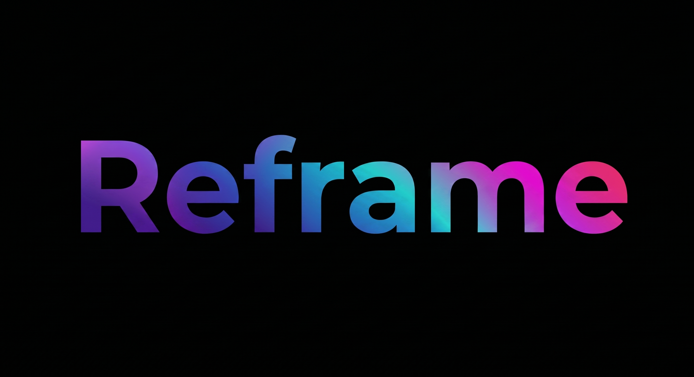
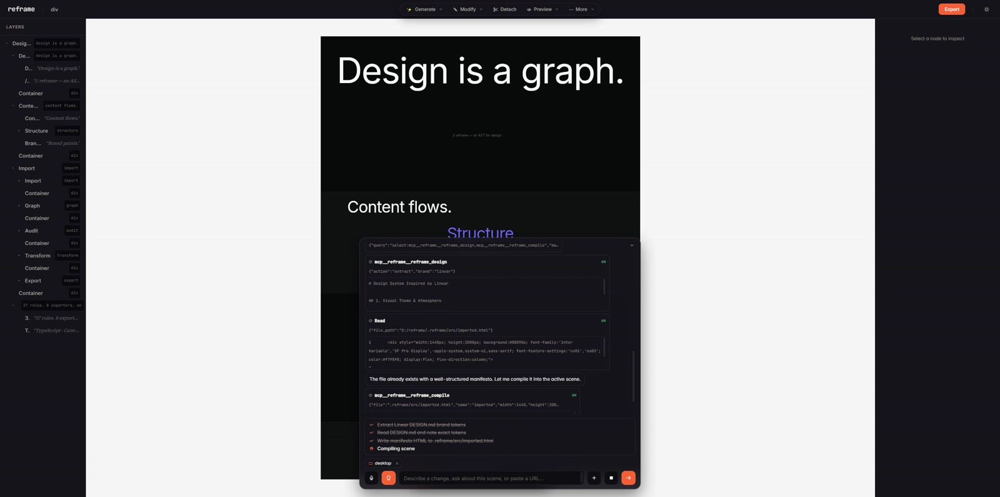

<h3 align="center">AI-Native Design Editor</h3>
<p align="center">
  
</p>
<p align="center">Design · Audit · Transform · Export — powered by INode AST</p>

<p align="center">
  
  
  
  
  
  
  
  
  
</p>

<p align="center">
  <a href="#try-it-in-60-seconds">Try It</a> · <a href="#ai-native-engine">AI-Native Engine</a> · <a href="#mcp-pipeline">MCP Pipeline</a> · <a href="#inode--the-design-ast">INode AST</a> · <a href="#platform">Platform</a> · <a href="#install">Install</a> · <a href="#license">License</a>
</p>

---

<table>
<tr>
<td>

**🚀 v0.1.0 — developer preview**

An AI-native design editor with a production-quality engine underneath. Interactive CanvasKit viewport (via [`@open-pencil/core`](https://github.com/open-pencil/open-pencil)) + 37-rule quality audit + 8 export formats — plus a **skill layer** that carries the taste memory the audit can't encode. **INode is to structured content what AST is to code.**

Two layers, one pipeline. The **engine** is deterministic: import → audit → transform → export, measured by 37 rules, 8 aesthetic metrics, and brand-fidelity scoring. The **skill layer** is taste: 7 role-framed skills with growing smell tables that catch genericness, fake content, brand drift, and slop signatures the engine can't measure.

Three input paths converge on one graph: **DESIGN.md** — brand spec, tokens, component recipes feed the audit and the agent. **Agent chat** integrated in the editor — AI writes HTML, refactors scenes, applies deterministic variations. **Direct editing** — Figma-like selection, drag, resize, text editing, context menu, keyboard shortcuts. Properties panel with live audit findings, bidirectional sync at `:4100/platform`. **7 MCP tools** (6 pipeline + `reframe_ui` for Playwright-backed Platform QA) drive external agents in Claude Code, Cursor, and any MCP-compatible client. 60+ brand design systems via [`getdesign`](https://www.npmjs.com/package/getdesign) npm. W3C DTCG token interop. .fig file import/export. Headless REST API for batch rendering and CI/CD.

</td>
</tr>
</table>

<br>

<p align="center">
  <a href="https://youtu.be/bnoORvlwFXY">
    
  </a>
</p>
<p align="center"><sub>▶ <a href="https://youtu.be/bnoORvlwFXY">Watch the demo</a> — one prompt → TodoWrite plan → brand extract → compile → live edit on canvas.</sub></p>

<br>

### Core Features

| 🎨 Interactive Canvas | 🤖 AI-Native Pipeline | ⚡ 8 Export Formats |
|---|---|---|
| CanvasKit (Skia WASM) viewport via @open-pencil/core. Select, drag, resize, text edit, context menu, keyboard shortcuts, zoom and pan. | 6 MCP tools for external agents. Every compile, inspect, and edit returns an inline PNG preview — multimodal agents **see** what they just built, no file round-trip. Integrated agent chat inside the editor — AI writes HTML, engine compiles, audits, exports. | One graph → HTML, React, SVG, PNG, PDF, Lottie, Animated HTML, Site. Plus W3C DTCG tokens. |

| ✅ 37-Rule Audit + Quality | 🔄 Deterministic Transforms | 🧑‍🎨 Unified Platform |
|---|---|---|
| Contrast, accessibility, brand compliance, spacing, 8 aesthetic metrics, brand fidelity scoring. Auto-fix pipeline and per-node audit findings. | Rebrand, resize, vary — no AI. Tokens, compile, lint — deterministic. Same inputs → same outputs, always. | Editable properties, live audit, bidirectional sync between canvas and panel at `:4100/platform`. |

---

## Try It In 60 Seconds

The fastest way to feel what reframe does — clone, build, open the Platform, type in the chat. No API key. Uses your existing [Claude Code](https://claude.com/claude-code) subscription for the in-canvas agent.

```bash
git clone https://github.com/ilya-makarov-dev/reframe.git
cd reframe && npm install && npm run build
npm start                                     # HTTP sidecar on :4100
```

Open **`http://localhost:4100/platform`** → click **+ Create Canvas** → type in the bottom chat:

```
landing page for a Linear-style dev tool, dark theme, one hero + 3 features
```

The agent picks the matching skill (`reframe-design`), writes HTML with brand + taste rules baked in, compiles it into an INode SceneGraph, runs the 37-rule audit, auto-fixes issues, and renders on the CanvasKit viewport. You direct from there — drag, resize, edit text, prompt again, export to HTML / React / PNG / PDF / site.

**No `claude` CLI?** The engine (compile / audit / tokens / resize / variations / 8 exporters) runs fully headless — see [MCP Pipeline](#mcp-pipeline) to drive it from any MCP client, or [@reframe/ui](#reframeui--standard-library) to build scenes in TypeScript. Only the in-canvas agent needs the CLI.

**Running into `EADDRINUSE` / Node < 18 / first-build issues?** Jump to [Install](#install) and [Known rough edges](#known-rough-edges-dev-preview) — everything is flagged there upfront.

---

## What is Reframe?

An AI-native design editor with a production-quality engine underneath. AI designs, human directs, engine guarantees quality.

The core insight: **INode is to visual design what AST is to code.** A typed, traversable tree that enables programmatic operations — audit, transform, export — the same way ESLint/Prettier/Babel work on code ASTs.

```
                    ╔═══════════════════════════════════════════════╗
                    ║                                               ║
                    ║          I N P U T S   →   G R A P H         ║
                    ║                                               ║
                    ╚═══════════════════════════════════════════════╝

       ┌─────────────┐      ┌─────────────┐      ┌─────────────┐
       │             │      │             │      │             │
       │  DESIGN.md  │      │ Agent Chat  │      │   Canvas    │
       │  ─────────  │      │  ─────────  │      │  ─────────  │
       │ brand spec  │      │ HTML · ops  │      │  Figma-like │
       │ tokens      │      │ refactors   │      │  direct     │
       │ component   │      │ variations  │      │  editing    │
       │ recipes     │      │             │      │             │
       └──────┬──────┘      └──────┬──────┘      └──────┬──────┘
              │                    │                    │
              └────────────────────┼────────────────────┘
                                   │
                                   ▼
    ╔══════════════════════════════════════════════════════════╗
    ║                                                          ║
    ║             I N O D E   S C E N E G R A P H              ║
    ║        typed tree — the design equivalent of an AST      ║
    ║                                                          ║
    ╠═══════════════════════╦══════════════════════════════════╣
    ║                       ║                                  ║
    ║  @open-pencil/core    ║  @reframe/core                   ║
    ║  ─────────────────    ║  ──────────────                  ║
    ║  THE  VIEWPORT        ║  THE  ENGINE                     ║
    ║                       ║                                  ║
    ║  CanvasKit (Skia WASM)║  INode AST + SceneGraph          ║
    ║  .fig import/export   ║  HTML → INode importer           ║
    ║  selection & drag     ║  Layout engine (Yoga WASM)       ║
    ║  resize handles       ║  37-rule audit + auto-fix        ║
    ║  snap guides          ║  8 aesthetic metrics             ║
    ║  undo / redo          ║  design tokens (W3C DTCG)        ║
    ║  text editing         ║  brand inheritance               ║
    ║  zoom / pan           ║  semantic classification         ║
    ║                       ║  universal resize engine         ║
    ║                       ║    (5 strategies: smart/contain/ ║
    ║                       ║     cover/stretch/reflow)        ║
    ║                       ║  variations engine (density /    ║
    ║                       ║    radius / shadows / colors /   ║
    ║                       ║    typography · Cartesian vary)  ║
    ║                       ║  8 export formats                ║
    ║                       ║  @reframe/ui (120 functions)     ║
    ║                       ║  23 animation presets            ║
    ║                       ║  content round-trip + diff       ║
    ║                       ║  assert (design tests for CI)    ║
    ║                       ║                                  ║
    ║  OP renders it.       ║  reframe IS it.                  ║
    ║                       ║                                  ║
    ╠═══════════════════════╬══════════════════════════════════╣
    ║  MIT · npm package    ║  AGPL-3.0 · this repo            ║
    ╠═══════════════════════╩══════════════════════════════════╣
    ║                                                          ║
    ║  @reframe/editor  — BRIDGE (OP viewport ↔ INode engine)  ║
    ║  GraphBridge converts SceneNode ←→ INode bidirectionally ║
    ║  canvas interaction → INode edits → server persist → SSE ║
    ║                                                          ║
    ╠══════════════════════════════════════════════════════════╣
    ║                                                          ║
    ║    60+ BRANDS           6 MCP TOOLS          8 EXPORTS   ║
    ║    ┌──────────┐        ┌──────────┐        ┌──────────┐ ║
    ║    │ stripe   │        │ design   │        │ html     │ ║
    ║    │ linear   │───────►│ compile  │───────►│ react    │ ║
    ║    │ vercel   │        │ inspect  │        │ svg/png  │ ║
    ║    │ spotify  │        │ edit     │        │ pdf      │ ║
    ║    │ airbnb   │        │ export   │        │ lottie   │ ║
    ║    │ ...57+   │        │ project  │        │ animated │ ║
    ║    └──────────┘        │ collab   │        │ site     │ ║
    ║                        └──────────┘        └──────────┘ ║
    ║                                                          ║
    ╚══════════════════════════════════════════════════════════╝
                               │
                               ▼
    ┌──────────────────────────────────────────────────────────┐
    │                                                          │
    │   P L A T F O R M   @  : 4 1 0 0                        │
    │                                                          │
    │   ┌─────────┬──────────────────────────┬─────────────┐  │
    │   │         │                          │             │  │
    │   │  Home   │    CanvasKit  Viewport   │  Sections   │  │
    │   │  Brand  │   ╌╌╌╌╌╌╌╌╌╌╌╌╌╌╌╌╌╌   │  Design     │  │
    │   │         │   drag · resize · zoom   │  Rebrand    │  │
    │   │  ─────  │   text · context menu    │  Vary       │  │
    │   │  Layers │   Ctrl+C/V/X/Z · Del    │  Quality    │  │
    │   │  (tree) │   Space=pan · H=hide    │  Tokens     │  │
    │   │         │   Arrow=nudge           │             │  │
    │   │         │                          │  ┌────────┐ │  │
    │   │         │    ┌─────────────────┐   │  │ fill ● │ │  │
    │   │   ▼ div │    │                 │   │  │ W: 400 │ │  │
    │   │   ▼ h1  │    │   Your design   │   │  │ H: 200 │ │  │
    │   │   ▼ btn │    │   lives here    │   │  │ r: 8px │ │  │
    │   │         │    │                 │   │  └────────┘ │  │
    │   │         │    └─────────────────┘   │             │  │
    │   └─────────┴──────────────────────────┴─────────────┘  │
    │                                                          │
    │   canvas ←──── bidirectional sync ────→ properties       │
    │          └────── POST /api/node/edit ──────┘             │
    │          └────────── SSE events ──────────┘              │
    │                                                          │
    └──────────────────────────────────────────────────────────┘
```

> **Inputs converge on one graph.** Brand loaded from DESIGN.md seeds tokens and audit rules. Agent writes HTML → engine compiles. User edits on canvas → engine updates. All paths end at the same INode SceneGraph. Same audit, same tokens, same export.

---

## Why

Design has no compiler. Code has ESLint, Prettier, TypeScript — parse, validate, transform, output. Design has Figma (proprietary), Canva (locked), and raw HTML (no validation).

**Reframe is the missing layer.** AI generates the design, engine guarantees the quality.

```
  AI GENERATES   brief → HTML → INode SceneGraph (structured design data)
  ENGINE AUDITS  37 rules: contrast, accessibility, brand compliance, aesthetic quality
  ENGINE FIXES   auto-fix pipeline resolves issues without human intervention
  HUMAN REVIEWS  interactive CanvasKit canvas — select, edit, approve
  ENGINE EXPORTS → HTML, React, SVG, PNG, PDF, Lottie, Animated HTML, Site
```

> The human is the creative director. AI is the designer. The engine is QA. Nobody ships without passing 37 rules.

---

## AI-Native Engine

The 37-rule audit + 8 aesthetic metrics + brand-fidelity score measure **structure** — contrast, spacing, alignment, token compliance — things you can compute. But structure isn't taste. A scene that scores PASS on every rule can still feel:

- **generic** — the AI-slop signature: 3 equal cards horizontally, centered hero with 5 elements, gradient-on-gradient buttons
- **fake** — invented stats ("trusted by 40k engineers"), invented testimonials, placeholder logos dressed up as real ones
- **tone-mismatched** — Inter on an editorial brand, serif in a dashboard, pure `#000` on a premium dark theme
- **brand-drifted** — colors swapped correctly but typography weight, letter-spacing, or component radius forgot the brand

These failures don't show up in numbers. So reframe pairs the deterministic engine with a **skill layer** — structured taste memory that grows with use.

### Two layers, one pipeline

```
  INPUT ──► ENGINE (deterministic)  ──► SKILL LAYER (taste)  ──► OUTPUT
            37 audit rules                7 role-framed skills
            8 aesthetic metrics           smell tables (grow)
            brand fidelity scoring        anti-patterns
            auto-fix pipeline             canonical flows
            Yoga layout + tokens          cross-skill taste rules
```

The engine catches structural bugs and guarantees reproducibility. The skills catch taste bugs the engine can't measure. Together they close the loop that "just an audit" or "just an LLM" each miss on their own.

### 7 skills, one per user intent

When the agent runs inside the Platform, every request routes through exactly one skill. Each carries role frame + sensitive surfaces + smell table + canonical flows + anti-patterns — not a procedure (the engine handles procedure), but the taste memory + failure-pattern memory the engine lacks.

| User intent | Skill | What it carries |
|---|---|---|
| "make a page / hero / form / dashboard" | [`reframe-design`](.claude/skills/reframe-design/SKILL.md) | anti-slop patterns, tension cues, "compiles clean but reads fake" smells |
| "use Stripe's style / apply brand / rebrand" | [`reframe-brand`](.claude/skills/reframe-brand/SKILL.md) | brand-intent → token translation, where brand fidelity drops in practice |
| "full site / sitemap / home + pricing + about + 404" | [`reframe-site-loop`](.claude/skills/reframe-site-loop/SKILL.md) | one-page-per-turn baton, brand freeze on turn 1, cross-page nav with real slugs |
| "a landing page" (vague, ≤ 10 words) | [`reframe-enhance`](.claude/skills/reframe-enhance/SKILL.md) | short interview protocol → structured brief before generation |
| "how does this look? / review / polish" | [`reframe-critic`](.claude/skills/reframe-critic/SKILL.md) | translates engine metrics into designer language, adds taste layer |
| "export to React / TSX / component library" | [`reframe-to-react`](.claude/skills/reframe-to-react/SKILL.md) | stack choice (inline / CSS-modules / Tailwind / styled), byte-deterministic handoff |
| "test the UI / QA the platform" (dev-side) | [`designer-qa`](.claude/skills/designer-qa/SKILL.md) | drives Chromium via `reframe_ui` through 11 canonical designer journeys |

### Smell tables grow

Every skill carries a **smell table** — failure patterns the audit can't encode, each with a detection cue and a fix. When the agent catches a new kind of failure (a novel brand drift, a new slop signature, an export-determinism gap), a row is added. The next session catches the same pattern in seconds instead of rediscovering it.

> The engine is deterministic; the skills are the memory the engine lacks. Structural measurement + growing taste memory is the moat.

### Cross-skill taste rules

A small set of rules the audit can't fully encode but every skill enforces, every time the agent writes HTML:

- Max **one** accent color above 80% saturation — a second high-sat color is noise
- No pure `#000` — use `#111`–`#1a` even on dark themes (pure black burns holes on dark layouts)
- **Inter banned** for premium / editorial contexts — use Geist / Outfit / Cabinet Grotesk / Söhne
- **No serifs in dashboards** — serif is editorial only
- **Never invent numbers, stats, logos, or testimonials** — use neutral labels ("trusted by teams", not "trusted by 40k engineers")
- **No "3 equal cards horizontally"** — use asymmetric grid / zig-zag / bento
- **Centered hero only when variance is low** — headline + CTA = centered OK; headline + 3 stats + image + 2 CTAs = not centered
- **Motion via `transform` / `opacity` only** — never animate `top/left/width/height`

### Why this architecture beats "just an LLM" or "just an audit"

|   | Just an LLM | Just an audit | reframe (engine + skills) |
|---|---|---|---|
| Reproducible output | no | n/a | yes — same inputs → same output |
| Catches contrast / accessibility | sometimes | yes | yes (37 rules, auto-fix) |
| Catches genericness / slop | rarely | no | yes (smell tables) |
| Catches fake content | rarely | no | yes (cross-skill rules) |
| Scales with experience | no (context window) | no (fixed rules) | yes (smell tables grow) |
| Testable in CI | no | partial | yes (`reframe test` + assert) |

---

## Architecture

```
  ┌──────────────────────────────────────────────────────────────┐
  │                                                              │
  │  TWO ENGINES, ONE GRAPH                                      │
  │                                                              │
  │  @open-pencil/core (MIT)           @reframe/core (AGPL)     │
  │  THE VIEWPORT                      THE ENGINE                │
  │  ──────────────                    ──────────                │
  │  ├ CanvasKit (Skia WASM)           ├ INode AST + SceneGraph  │
  │  ├ SkiaRenderer                    ├ HTML → INode importer   │
  │  ├ .fig read/write (Kiwi)          ├ Layout engine (Yoga WASM) │
  │  ├ selection / drag / resize       ├ 37-rule audit engine    │
  │  ├ undo/redo + snap guides         ├ 8 aesthetic metrics     │
  │  ├ text editing                    ├ auto-fix pipeline       │
  │  ├ zoom / pan                      ├ design tokens (W3C DTCG)│
  │                                    ├ brand inheritance       │
  │  renders pixels on GPU,            ├ semantic classification  │
  │  handles pointer interaction       ├ resize / adapt / vary   │
  │                                    ├ 8 export formats        │
  │                                    ├ @reframe/ui (120 fns)   │
  │                                    ├ animation (23 presets)  │
  │                                    ├ variations engine       │
  │                                    ├ content round-trip      │
  │                                    ├ diff engine             │
  │                                    └ assert (design tests)   │
  │                                                              │
  │  OP renders it.                    reframe IS it.            │
  │                                                              │
  │           └──────────┬───────────────────┘                   │
  │                      ▼                                       │
  │  @reframe/editor (AGPL)            @reframe/mcp (AGPL)      │
  │  THE BRIDGE                        THE PLATFORM              │
  │  ──────────                        ────────────              │
  │  ├ GraphBridge (OP ↔ INode)        ├ 6 MCP tools             │
  │  ├ CanvasKit canvas bootstrap      ├ HTTP server (:4100)     │
  │  ├ interaction (drag/snap/text)    ├ SSE real-time sync      │
  │  ├ context menu + keyboard         ├ REST API (headless)     │
  │  ├ properties panel binding        ├ Platform UI              │
  │  ├ embedded agent chat             ├ /api/agent/* endpoints   │
  │  └ bidirectional sync              └ session + store          │
  │                                                              │
  │  DATA FLOW — everything converges on INode SceneGraph        │
  │                                                              │
  │  Agent chat  → /api/agent/chat  ──┐                          │
  │  MCP prompt  → reframe_compile ────┤─→ INode SceneGraph      │
  │  .fig file   → @open-pencil/core ──┤         │                │
  │  Canvas edit → OP editor ──────────┘         │                │
  │                                                │              │
  │       ┌──── properties panel ←── SSE ──────────┘              │
  │       │                                                       │
  │       ▼                                                       │
  │  ┌────────────────────────────────────────────────────┐      │
  │  │ ENGINE: audit → tokens → adapt → vary → export     │      │
  │  │  37 rules · 8 aesthetics · brand fidelity · DTCG   │      │
  │  └─────────────────────┬──────────────────────────────┘      │
  │                        ▼                                     │
  │  OUTPUT (8 core formats)                                      │
  │  html · react · svg · png · pdf · lottie · animated · site   │
  │  + tokens.json (DTCG) · scene.json (portable INode)          │
  │                                                              │
  └──────────────────────────────────────────────────────────────┘
```

---

## Quick Start

### For AI Agents — MCP

Add to your MCP client config (Claude Code, Cursor, Windsurf, Cline). Point at the built entrypoint inside your cloned checkout:

```json
{
  "mcpServers": {
    "reframe": {
      "command": "node",
      "args": ["/absolute/path/to/reframe/packages/mcp/dist/mcp/src/index.js"]
    }
  }
}
```

> Once npm publish lands, this becomes `npx @reframe/mcp` — one line, zero paths. Tracking in the roadmap below.

**The pipeline:**

```
1. reframe_design({ action: "list" })                          → browse 60+ brand design systems
   reframe_design({ action: "extract", brand: "stripe" })      → full DESIGN.md → .reframe/design.md
   (or url: "https://..." to extract from any website)
2. reframe_compile({ html: "<div>...</div>" })                 → AI writes HTML → INode
3. reframe_inspect({ sceneId: "s1" })                          → 37-rule audit (REQUIRED)
4. reframe_edit({ operations: [{ op: "update", ... }] })       → fix issues
5. reframe_export({ sceneId: "s1", format: "site" })           → export
```

AI writes creative HTML using brand values from DESIGN.md. Reframe validates against 37 audit rules (colors, typography, font features, component specs, spacing, aesthetic quality), auto-fixes issues, and exports to 8 formats.

Each of those four tools — `compile`, `inspect`, `edit`, and `export format:"png"` — returns an inline PNG preview in the MCP response, so multimodal agents can critique their own output visually on every step. Details under _MCP Pipeline_ below.

### For Developers — @reframe/ui

120 composable TypeScript functions that build INode trees. The programmatic API to the same AST that MCP and Platform use.

```typescript
import { render, page, stack, row, heading, body, button, card } from '@reframe/ui';

const primary = '#7c3aed';
const plans = [
  { name: 'Free', price: '$0', features: ['5 projects', 'Community support'] },
  { name: 'Pro', price: '$29', features: ['Unlimited', 'Priority support', 'API'] },
];

const html = await render(
  page({ w: 1440 },
    stack({ pad: [140, 80], gap: 32, align: 'center', fills: ['#09090b'] },
      heading('Simple pricing', { fontSize: 48, fills: ['#fafafa'] }),
      row({ gap: 24, justify: 'center' },
        ...plans.map(p => card({ layoutGrow: 1, pad: 32, gap: 16, fills: ['#111'] },
          heading(p.name, { level: 3, fills: ['#fafafa'] }),
          heading(p.price, { level: 2, fills: [primary] }),
          ...p.features.map(f => body(`✓ ${f}`, { fontSize: 14, fills: ['#a1a1aa'] })),
          button('Get started', { variant: 'filled', color: primary }),
        )),
      ),
    ),
  ),
);
```

> **This is what makes it programmable** — variables, loops, conditionals, themes.  
> Figma can't loop. HTML can't be validated. `@reframe/ui` is code that produces verified design.

### For CI/CD

The `@reframe/cli` exposes `build` (compile every scene listed in the project config) and `test` (assert all audit rules pass). Once published to npm:

```yaml
# .github/workflows/design.yml
- run: npx reframe build   # compile all scenes from config
- run: npx reframe test    # assert design rules pass
```

From source today: `node packages/cli/dist/index.js build` / `... test`.

---

## INode — The Design AST

INode is to visual design what the DOM is to documents — a universal, structured representation. Every visual tool uses the same primitives. INode makes them explicit and programmable.

```typescript
interface INode {
  // Identity
  type: 'FRAME' | 'TEXT' | 'RECTANGLE' | 'ELLIPSE' | 'GROUP' | 'VECTOR';
  name: string;

  // Geometry
  x, y, width, height, rotation: number;

  // Visual
  fills: Paint[];              // solid, gradient, image
  strokes: Paint[];            // borders
  effects: Effect[];           // drop shadow, inner shadow, blur
  cornerRadius: number;
  opacity: number;

  // Layout (CSS Flexbox + Grid)
  layoutMode: 'HORIZONTAL' | 'VERTICAL' | 'GRID' | 'NONE';
  primaryAxisAlign: 'MIN' | 'CENTER' | 'MAX' | 'SPACE_BETWEEN';
  counterAxisAlign: 'MIN' | 'CENTER' | 'MAX' | 'STRETCH';
  itemSpacing: number;
  padding: { top, right, bottom, left };
  layoutGrow: number;          // flex-grow

  // Typography
  characters: string;
  fontSize, fontWeight: number;
  fontFamily: string;
  lineHeight, letterSpacing: number;
  fontFeatureSettings: string[]; // OpenType: ['ss01', 'tnum']
  styleRuns: StyleRun[];       // rich text

  // Behavior
  states: { hover: {...}, active: {...}, focus: {...} };
  responsive: [{ maxWidth: 768, props: { fontSize: 28 } }];

  // Semantic
  semanticRole: 'button' | 'heading' | 'nav' | 'hero' | 'cta';
  href: string;                // navigation target
}
```

**Adapters** bridge INode to external tools. The Standalone adapter runs headless (Node.js, MCP, CI). The Figma adapter maps INode ↔ SceneNodes. Write an adapter (~200 lines) and any design tool speaks the same language.

---

## MCP Pipeline

7 tools: 6 for the design pipeline + `reframe_ui` for Platform UI automation. Continuous feedback loop — not a linear pipeline.

```
compile → inspect → [edit → inspect]* → export → user reviews
                                                       │
            ↑          "make the CTA bigger"           │
            └──────────────────────────────────────────┘
            edit → inspect → export → user reviews again
```

**6 pipeline tools** — one per phase of the flow:

| Tool | Purpose |
|------|---------|
| `reframe_design` | `list` 60+ brands, `extract` by slug/URL/HTML → DESIGN.md, `prompt` for AI context |
| `reframe_compile` | AI writes HTML → import to INode. 37-rule audit + auto-fix. Aesthetic quality scoring. Semantic role classification. |
| `reframe_inspect` | Tree + 37-rule audit + 8 aesthetic metrics + fix hints. Semantic skeleton. Diff mode. |
| `reframe_edit` | **Single surface for all scene mutations.** Structural: `update`/`add`/`delete`/`clone`/`resize`/`move`. Theming: `defineTokens`/`setMode`. Variations: `scaleSpacing`/`scaleRadius`/`scaleShadows`/`rotateColors`/`typographyPreset`. Advanced: `iterate` (audit+fix loop), `adapt` (responsive variants), `vary` (Cartesian grid), `multiColumn` (grid layout). |
| `reframe_export` | 8 formats: html, react, svg, png, pdf, lottie, animated_html (CSS/WAAPI), site |
| `reframe_project` | Save/load, history, snapshots, components, macros, brand registry, DTCG token export/import, content round-trip (MD ↔ INode). |

**Plus one for the browser:** `reframe_ui` — Playwright-backed Platform UI automation. `open` launches a Chromium session, `act` clicks/types/scrolls/waits, `probe` runs `querySelector` + eval, `screenshot` captures state. Every mutating call returns an inline PNG + console/network error digest. Mirrors what `reframe_compile` / `inspect` / `edit` do for the engine — but for the browser-side Platform, so the agent can reproduce UI bugs, verify fixes, and walk multi-step flows end-to-end. Used by the [`designer-qa`](.claude/skills/designer-qa/SKILL.md) skill to sweep 11 canonical designer journeys.

### The agent can *see* the scene — inline PNG preview

`compile`, `inspect`, `edit`, and `export format:"png"` now return a rendered PNG of the current scene as an MCP `image` content block, alongside the usual text report. Multimodal agents (Claude, GPT-4o, Gemini) see the design inline on every iteration — no separate `Read` or file round-trip.

```
reframe_compile({ html }) →  content: [
                               { type: "text", text: "PASS · 74% Good · 593 nodes" },
                               { type: "image", mimeType: "image/png", data: "<base64>" }  ← auto
                             ]
```

Why this matters:
- **Fixes come faster.** The agent spots "the CTA is invisible on a dark hero" visually instead of inferring it from contrast numbers.
- **Taste not just metrics.** The audit surfaces contrast, spacing, brand fidelity; the image surfaces ugly. Both feed the next `reframe_edit`.
- **Works with any text-only wrapper too.** The text report still ships — agents without a vision lane just ignore the image block.

Defaults:
- Auto-downscaled to fit ≤1200 px wide; skipped entirely if the rendered PNG would bust the MCP payload cap (fails gracefully — the text report still ships).
- Opt-out with `preview: false` on any of the four tools when you're running batch/CI pipelines and just want the numbers.
- PNG text rendering uses a system TTF (Segoe UI on Windows, Helvetica on macOS, DejaVu on Linux) loaded once per process. If no font is found, glyphs fall back to boxes — a warning you'll spot instantly in the preview.

### CLI vs MCP (quick map)

| Flow | CLI (`reframe` in packages/cli) | MCP (7 tools above) |
|------|----------------------------------|----------------------|
| Import / build | `reframe build`, configs | `reframe_compile`, `reframe_edit` |
| Audit / tree | `reframe test`, export-svg | `reframe_inspect` |
| Export | `reframe build` outputs | `reframe_export` |
| Brand / tokens | project + `.reframe/design.md` | `reframe_design`, `defineTokens` in edit |
| Persistence | `.reframe/` on disk | `reframe_project` + session store |

Same engine (`packages/core`): MCP tools call into compile, audit, serialize, exporters — matching the CLI where they share code paths.

Export is not the final step — it's a **preview**. User sees the result, gives feedback, AI edits, inspects, exports again. The loop continues until the user is happy.

Inspect gives **edit commands**, not just errors:
```
[!] contrast 2.57:1 for "Product"
    → reframe_edit: update "Product" props: { fills: ["#fafafa"] }
```

### Multi-Page Sites

```
reframe_compile({ html: "...", name: "home" })
reframe_compile({ html: "...", name: "pricing" })
reframe_compile({ html: "...", name: "about" })
reframe_export({ sceneId: "s1", format: "site" })
```

> Produces a single HTML file: hash routing, page transitions, auto-linked navigation, active nav state.

---

## DESIGN.md — Brand as Code

Not a config file — a **design philosophy** in prose. Teaches AI agents how to design in your brand. Teaches the 37-rule audit engine what to enforce.

60+ curated brand design systems are available via [`getdesign`](https://www.npmjs.com/package/getdesign) npm package — load any of them with one MCP call:

```
reframe_design({ action: "list" })                    → browse all brands
reframe_design({ action: "extract", brand: "stripe" }) → full 300-line DESIGN.md
```

Each DESIGN.md covers **9 sections**: Visual Atmosphere, Color Palette, Typography Rules (with OpenType features), Component Stylings (button variants, cards, badges, inputs, nav), Layout Principles (spacing scale, radius scale), Depth & Elevation (multi-layer shadows), Do's and Don'ts, Responsive Behavior, Agent Prompt Guide.

```markdown
## 3. Typography Rules
### Font Family
- **Primary**: `sohne-var`, fallbacks: `SF Pro Display`
- **OpenType Features**: `"ss01"` on all text; `"tnum"` for tabular numerals

### Hierarchy
| Role | Size | Weight | Line Height | Letter Spacing | Features |
|------|------|--------|-------------|----------------|----------|
| Display Hero | 56px | 300 | 1.03 | -1.4px | ss01 |
| Body | 16px | 300 | 1.40 | normal | ss01 |

## 4. Component Stylings
### Buttons
**Primary** — bg `#533afd`, text `#fff`, radius 4px, hover `#4434d4`
**Ghost** — transparent, border `#b9b9f9`, hover `rgba(83,58,253,0.05)`
```

The parser extracts everything: colors, typography with font features, button variants with hover states, card/badge/input/nav specs, spacing scale, gradients, multi-layer shadows. The audit validates the agent's HTML against all of it.

**Create your own:** Copy [`DESIGN.md.example`](DESIGN.md.example), fill in your brand values, and the engine parses it automatically.

---

## Audit Engine

37 rules across 7 categories. Most auto-fix.

| Category | Rules | Auto-fix |
|----------|-------|:--------:|
| **Accessibility** | contrast-minimum (WCAG AA), min-touch-target (44px), min-font-size | ✓ |
| **Structural** | text-overflow, node-overflow, content-overflow, container-underflow, sibling-overlap, no-empty-text, no-zero-size, no-hidden-nodes | partial |
| **Brand** | font-in-palette, color-in-palette, font-weight, font-size-role, border-radius, spacing-grid | ✓ |
| **Component Specs** | component-spec-compliance, font-features-compliance (OpenType), spacing-scale-compliance, state-completeness (hover states) | ✓ |
| **Design Quality** | visual-hierarchy, content-density, visual-balance, cta-visibility | — |
| **Aesthetic** | alignment, whitespace, harmony, proportion, rhythm, readability, overall (8 metrics, 0–100% scores) | — |
| **Semantic** | cta-contrast, heading-hierarchy, caption-readability, touch-target, landmark-presence | ✓ |

---

## Universal Resize — `adapt` op

> **Preview.** Works end-to-end on common patterns, still maturing on edge cases.

Deterministic layout adaptation — no AI, no guessing. The engine classifies elements by role, detects layout patterns, and remaps content to target dimensions. Five strategies: **smart** (default — classify + reflow), **contain** / **cover** (aspect-preserving), **stretch** (raw proportional), **reflow** (pure flex re-pack).

```
1920×1080 hero  →  classify (title, button, background)
                →  detect pattern (full_bleed_hero)
                →  select guide (728×90 template)
                →  remap elements to slots
                →  728×90 banner — re-composed, not scaled
```

One design → banner, social card, story, OG image, mobile/tablet/desktop. Milliseconds. Pure computation — deterministic, reproducible, no LLM needed.

---

## Brand Inheritance

`reframe_edit { op: "defineTokens", brand: "stripe" }` is the one-shot **"rebrand this scene"** pipeline:

```
1. Parse DESIGN.md → DesignSystem
      (colors, typography with OpenType, button/card/badge/input/nav specs)
2. Tokenize + auto-bind every node to the right token role
3. Semantic rebrand with polarity detection
      (scene-dark-on-scene-dark vs brand-dark-on-brand-light)
4. Contrast-aware text color selection
      (walks parents to find effective bg, ranks tokens by WCAG contrast)
5. applyBrandInheritance — runs component recipes on matching nodes
      (buttons get exact radius/height/padding/hover states from the spec;
       cards, badges, inputs, navs likewise)
```

One call = "make this scene look like Spotify / Stripe / Ferrari."

---

## Variations — Deterministic Design Space

No AI. Pure transforms. Exposed as `reframe_edit` ops and via Platform UI:

| Axis | Op | Values |
|------|----|--------|
| Density | `scaleSpacing` | factor (<1 compact, >1 spacious) |
| Radius | `scaleRadius` | sharp / soft / pill / editorial / factor |
| Shadows | `scaleShadows` | flat / subtle / normal / dramatic / factor |
| Colors | `rotateColors` | invert-accent / invert-mode / [tokenA, tokenB] |
| Typography | `typographyPreset` | dramatic / flat / editorial / technical / friendly |
| Grid | `vary` | Cartesian product of all axes + brand + mode |

```
reframe_edit({ operations: [{
  op: "vary",
  sceneId: "s1",
  axes: {
    brand: ["stripe", "linear", "vercel"],
    density: [0.75, 1, 1.25],
    radius: ["sharp", "soft", "pill"]
  }
}]})  // → 27 new session scenes, one per combination
```

Same input → same output, every time.

---

## Platform

Design workspace at `http://localhost:4100/platform`. CanvasKit pan/zoom canvas with bidirectional property sync.

```
╔══════════════════════════════════════════════════════════════════════╗
║                                                                      ║
║   DASHBOARD — single entry point, chat lives on the canvas           ║
║                                                                      ║
║   ┌────────────────────────────────────────────────────────────┐   ║
║   │              + Create Canvas                                │   ║
║   │   Empty frame, start from scratch or let the agent design.  │   ║
║   └────────────────────────────────────────────────────────────┘   ║
║                                                                      ║
║   ── Projects ──────────────────────────────────────────             ║
║   ┌────────┐ ┌────────┐ ┌────────┐ ┌────────┐                      ║
║   │ stripe │ │pricing │ │ hero   │ │landing │   ← click to open    ║
║   │ 3 vars │ │ 1440px │ │ 85%   │ │ 2 vars │      on canvas       ║
║   └────────┘ └────────┘ └────────┘ └────────┘                      ║
║                                                                      ║
╠══════════════════════════════════════════════════════════════════════╣
║                                                                      ║
║   CANVAS WORKSPACE — Figma-like editing on CanvasKit                 ║
║                                                                      ║
║   ┌─────────┬──────────────────────────────┬─────────────────┐      ║
║   │         │                              │  Properties     │      ║
║   │  Home   │                              │  ──────────     │      ║
║   │  Brand  │                              │  fill  ● #533A  │      ║
║   │         │                              │  W 1440  H 900  │      ║
║   │  ─────  │                              │  radius    8px  │      ║
║   │  Layers │       YOUR  DESIGN  HERE     │  opacity  100%  │      ║
║   │         │                              │  ────────       │      ║
║   │  ▸ root │   drag · resize · text       │  Audit          │      ║
║   │    ▸ h1 │   zoom · pan · context menu  │  Findings       │      ║
║   │    ▸ btn│   Ctrl+C/V/X/Z · Del         │  ◆ low contrast │      ║
║   │    ▸ img│                              │    → auto-fix   │      ║
║   │         │                              │  ◆ non-brand    │      ║
║   │         │                              │    font         │      ║
║   │         │                              │    → Ask agent  │      ║
║   └─────────┴──────────────────────────────┴─────────────────┘      ║
║                                                                      ║
║   BIDIRECTIONAL SYNC                                                 ║
║   canvas drag ───► POST /api/node/edit  ──► server persist           ║
║   panel edit  ───► POST /api/node/edit  ──► canvas re-render         ║
║   server SSE  ───► real-time event ────────► all clients update      ║
║   agent chat  ───► POST /api/agent/chat ──► streamed via SSE         ║
║                                                                      ║
╠══════════════════════════════════════════════════════════════════════╣
║                                                                      ║
║   HEADLESS API (/api/*)                                              ║
║                                                                      ║
║   GET  /api/render/{id}?format=png&brand=stripe&scale=2             ║
║   POST /api/render/batch  { formats[], brands[], viewports[] }      ║
║   GET  /api/tokens/{id}?format=dtcg    ← W3C Design Tokens         ║
║   POST /api/tokens/{id}                ← import .tokens.json        ║
║   GET  /api/audit/{id}?aesthetic=true  ← 37 rules + 8 metrics      ║
║   POST /api/agent/chat                 ← SSE; embedded agent        ║
║   GET  /api/scenes                     ← list all                   ║
║   GET  /thumbnail/{id}.png             ← CanvasKit raster          ║
╠══════════════════════════════════════════════════════════════════════╣
║                                                                      ║
║   UNIVERSAL FLOW — every scenario follows this pattern:              ║
║                                                                      ║
║   SOURCE ────→ TRANSFORM ────→ QUALITY ────→ DELIVER                 ║
║                                   ↑    │                             ║
║                                   └────┘  loop until pass            ║
║                                                                      ║
║   SOURCE:     HTML │ Blocks │ Figma │ URL │ DESIGN.md                ║
║   TRANSFORM:  Tokens │ Rebrand │ Variations │ Adapt │ Animate        ║
║   QUALITY:    37 audit rules + 8 aesthetic metrics                    ║
║   DELIVER:    8 export formats + REST API + batch pipeline          ║
║                                                                      ║
║   The AI is the designer. The human is the art director.             ║
║   The engine is the factory.                                         ║
║                                                                      ║
╚══════════════════════════════════════════════════════════════════════╝
```

| Feature | Status |
|---------|--------|
| **Dashboard** — single "Create Canvas" entry + project grid | ✓ |
| **CanvasKit viewport** — pan/zoom/select/drag/resize/text via @open-pencil/core | ✓ |
| **Figma-like interaction** — drag-to-move, context menu, copy/paste/duplicate/delete, hide/show/lock, keyboard shortcuts | ✓ |
| **Embedded agent chat** — invoke the AI inside the editor; runs the agent locally via `claude -p` (uses your Claude Code subscription, no API key). Streams text and tool calls over SSE | ✓ |
| **Deterministic variations** — engine generates alternates (density, radius, shadows, colors, typography) on top of any scene | ✓ |
| **Properties panel** — always visible, no tabs; editable: size, position, layout, fill (color picker + brand tokens), typography, effects, stroke, states, animation, OpenType, corner smoothing, constraints | ✓ |
| **Live audit findings** — per-node contrast / brand / accessibility issues surfaced in the Properties panel with inline fix actions; brand-fidelity chip (0–100%) | ✓ |
| **Canvas settings** — editable W/H + background color when nothing selected | ✓ |
| **Bidirectional sync** — canvas → server (drag/resize persist), properties → canvas (instant update), SSE real-time, suppression flag prevents pull/push races | ✓ |
| **Brand picker** — toolbar dropdown, instant rebrand via API | ✓ |
| **History dropdown** — ops log + named snapshots, restore / revert-to / clear | ✓ |
| **Sidebar** — Home + Brandbook + Layers tree (on canvas pages) | ✓ |
| Export dropdown — HTML / React / SVG / PNG / PDF / Lottie / Animated / Site | ✓ |
| Real-time MCP sync (SSE, debounced 300–1000ms per channel) | ✓ |

### Agent in Canvas — not a tab, a cursor

The agent is not a sidebar panel you switch to — it floats where you point. Cmd+K opens a prompt anchored at the cursor. Right-click any node → "✨ Ask agent" opens the same prompt with the node pre-scoped. The Properties panel has a sticky AI bar at the top so suggestions are always one key away. Smart Suggestions (from the live audit) render as click-to-fix banners next to each finding.

Under the hood: `POST /api/agent/chat` spawns a local `claude -p --output-format stream-json` subprocess and streams its NDJSON (session_start / text / tool_use / tool_result / done) back to the browser over SSE. The agent has access to this repo's MCP tools (`reframe_compile`, `reframe_inspect`, `reframe_edit`, etc.) via the project's `.mcp.json`.

Cost / auth model: the user's existing **Claude Code subscription** pays for it. No API key to configure, no separate billing. If you've got `claude` on your `$PATH`, the platform is ready.

```
Cmd+K (or right-click → Ask agent)
   │
   ▼
POST /api/agent/chat  { prompt, activeSceneId, activeNodeId, variants: 1|2|4 }
   │
   ▼ inject preamble (active brand DESIGN.md + node snapshot)
   │
spawn claude -p --output-format stream-json
   │
   ▼ parse NDJSON
SSE events ──► chat renders text + tool_use cards ──► variants appear as sibling scenes
```

Variants chip `[ 1 │ 2 │ 4 ]` applies the engine's deterministic variations (vary / scaleSpacing / scaleRadius / rotateColors / typographyPreset) to the generated output. Midjourney-style: one prompt, N takes, pick the best.

### Snapshots

The history dropdown doubles as a git-lite: `/platform/api/history/save` captures a full `serialize(scene)` into an in-memory store (LRU 30 per scene). `/restore` deserializes back into the session. `/revert-to` walks the ops log backwards and replays inverse props atomically.

---

## Animation

> **Beta** — functional, actively improving.

23 presets + custom keyframes + spring physics. Export as CSS @keyframes, WAAPI (Web Animations API with springs), or Lottie JSON.

```
reframe_export({
  sceneId: "s1",
  format: "animated_html",
  animate: {
    presets: [
      { nodeName: "Headline", preset: "fadeSlideUp", delay: 0 },
      { nodeName: "CTA", preset: "scaleIn", delay: 400 }
    ]
  }
})
```

<details>
<summary><strong>All 23 presets</strong></summary>

`fadeIn` · `fadeOut` · `slideInUp` · `slideInDown` · `slideInLeft` · `slideInRight` · `scaleIn` · `scaleOut` · `popIn` · `bounce` · `revealLeft` · `revealUp` · `pulse` · `shake` · `typewriter` · `colorShift` · `blurIn` · `fadeSlideUp` · `fadeSlideDown` · `fadeSlideLeft` · `fadeSlideRight` · `fadeScaleIn`

Stagger support for sequential animations across multiple elements.

</details>

---

## @reframe/ui — Standard Library

120 TypeScript functions. The programmatic interface to INode.

<details>
<summary><strong>Full function reference</strong></summary>

| Module | Count | Functions |
|--------|:-----:|-----------|
| Layout | 9 | `page` `stack` `row` `center` `wrap` `grid` `spacer` `container` `overlay` |
| Text | 8 | `heading` (h1-h6) `body` `label` `caption` `display` `mono` `divider` `image` |
| Interactive | 6 | `button` `link` `input` `select` `toggle` `navItem` |
| Containers | 8 | `card` `badge` `chip` `tag` `avatar` `stat` `quote` `listItem` |
| Data | 5 | `table` `tabs` `accordion` `progress` `keyValue` |
| Navigation | 4 | `sidebar` `breadcrumb` `pagination` `stepper` |
| Feedback | 6 | `modal` `toast` `tooltip` `alert` `banner` `emptyState` |
| Forms | 5 | `checkbox` `radio` `slider` `formGroup` `searchInput` |
| Sections | 9 | `heroSection` `featureGrid` `pricingSection` `testimonialSection` `ctaSection` `footerSection` `navbarSection` `logoBar` `statsBar` |
| Theme | 3 | `createTheme` `themed` `fromDesignMd` |
| Render | 2 | `render` `renderAll` |

</details>

---

## How It's Different

Reframe is not a replacement for design tools — it's infrastructure that sits between creation and production.

| What you get | How |
|-------------|-----|
| **Open format** | INode AST — not proprietary, not locked to any editor |
| **Automated QA** | 37 audit rules + 8 aesthetic quality metrics. Auto-fix. Runs in CI. |
| **Multi-format export** | One design → 8 formats (HTML, React, SVG, PNG, PDF, Lottie, Animated, Site) |
| **AI-native pipeline** | 6 MCP tools — any AI agent can design, validate, export |
| **Brand compliance** | DESIGN.md = brand philosophy. 60+ brands via npm. W3C DTCG token interop. |
| **Deterministic resize** | Universal `adapt` op — classify, detect pattern, remap to target size. 5 strategies (smart / contain / cover / stretch / reflow). No AI. |
| **Deterministic variations** | Engine ops (`scaleSpacing`, `scaleRadius`, `rotateColors`, `typographyPreset`) produce variants from one graph. Cartesian `vary` grid for side-by-side exploration. |
| **Design as code** | Version-controlled, testable, composable |

> **The analogy:** ESLint doesn't replace your editor — it validates your code. Reframe doesn't replace your design tool — it validates, adapts, and exports your design.

---

## Package Layout

```
packages/
│
├── core/       @reframe/core  ← THE ENGINE (the big one)
│               INode AST · SceneGraph · typed traversable design tree
│               layout engine (own logic on Yoga WASM, flex + CSS Grid)
│               importers (HTML with Tailwind, SVG, .fig)
│               audit engine (37 rules across 7 categories, auto-fix)
│               aesthetic scoring (8 visual quality metrics, 0-100%)
│               design-system parser + brand inheritance engine
│                 (component recipes: button/card/badge/input/nav,
│                  WCAG-contrast-aware token binding, polarity detection)
│               tokens (W3C DTCG format, light/dark, rebrand pipeline)
│               resize engine (5 strategies: smart/contain/cover/stretch/reflow)
│               variations engine (spacing/radius/shadows/colors/typography
│                          + Cartesian grid — deterministic, no AI)
│               8 export formats (HTML, React, SVG, PNG, PDF, Lottie,
│                          animated CSS/WAAPI, multi-page site)
│               @reframe/ui (120 composable functions — design as code)
│               animation (23 presets, spring physics, stagger)
│               semantic layer (auto-classify nodes by visual properties)
│               content round-trip · diff engine · assert (CI testing)
│
├── editor/     @reframe/editor
│               GraphBridge (OP ↔ reframe INode conversion)
│               CanvasKit canvas bootstrap + SkiaRenderer
│               interaction (drag/marquee/snap/resize/text/reorder)
│               Properties panel (single, always-visible)
│               embedded agent prompt + live audit findings
│               context menu · keyboard shortcuts · text overlay
│               StoreSync (SSE pull + debounced PUT push, race-proof)
│
├── mcp/        @reframe/mcp
│               MCP server (6 pipeline tools + reframe_ui for Platform QA)
│               HTTP sidecar on port 4100 (dual-stack `::` bind)
│               Platform UI — dashboard + canvas editor shell
│                 (split into 16 feature-section files under platform/ui/,
│                  concatenated at build time into /platform/app.js)
│               /api/agent/* — chat streamed over SSE
│                 spawns local `claude -p --output-format stream-json`
│               Headless REST API (/api/render, /api/tokens, /api/audit)
│               session management · auto-fix · snapshots (LRU 30/scene)
│               brand catalog (60+ via getdesign npm)
│
└── cli/        @reframe/cli
                `reframe build` · `reframe test` · config loader
```

---

## Install

**Requirements:** Node.js >= 18, [Claude Code](https://claude.com/claude-code) on `$PATH` (optional — only if you want the embedded agent).

```bash
git clone https://github.com/ilya-makarov-dev/reframe.git
cd reframe
npm install
npm run build
npm test        # optional — run the regression suite
npm start       # launches HTTP sidecar on :4100
```

Then open `http://localhost:4100/platform` and start designing.

> **Run `npm start` from the repo root, not from `packages/mcp/`.** The sidecar resolves the workspace via `process.cwd()` — scenes, brands, chat history, and `.reframe/project.json` all live relative to wherever you started. If you launch from a subdirectory the sidecar will happily boot but point at the wrong `.reframe/` folder and look empty. `packages/mcp` has its own `npm start` that runs the **stdio** MCP (for Claude Desktop / MCP clients) — that's a different entry point; don't confuse the two.

### How the in-UI agent works

`npm start` boots one process — the **HTTP sidecar** on `:4100`. That sidecar is everything the browser needs: it serves the Platform UI, accepts `POST /api/agent/chat`, and streams results back over SSE. You, the user, never deal with MCP wiring, API keys, or subprocess orchestration — you just open the page and type in the chat.

```
   user opens browser  :4100/platform   ◄── HTTP sidecar already running
              │
              │  user types in the bottom chat
              ▼
   POST /api/agent/chat  ───────────────┐
                                         │
              HTTP sidecar handles  ◄────┘
                    │
                    │  ensures .mcp.json exists
                    │  injects brand + scene preamble
                    │
                    ▼
              spawn  claude -p --output-format stream-json
                    │
                    │  claude picks up .mcp.json from cwd
                    │  opens stdio channel to reframe-mcp
                    │  calls reframe_compile / edit / inspect / export
                    │
                    ▼
              scenes autosave to .reframe/scenes/
                    │
                    ▼
              sidecar re-syncs from disk  ──► SSE event  ──► canvas updates live
```

One command (`npm start`) is all the user runs. Everything downstream — `.mcp.json` generation, `claude` subprocess, stdio MCP, disk sync, SSE fanout — is handled automatically inside the sidecar. No dev console required.

### Bring your own Claude Code — no API key, no extra billing

The embedded agent runs against the **`claude` CLI already on your machine**. If you use Claude Code for development, the same subscription powers design: the Platform spawns `claude -p --output-format stream-json` as a subprocess and streams NDJSON back over SSE. Nothing to configure, no OpenAI / Anthropic key to paste, no token accounting to wire up.

```
  your Claude Code subscription  ─────►  reframe Platform
  (already installed, already paid)       (local, spawns `claude -p`)
```

Don't have Claude Code? The engine — import, audit, tokens, resize, variations, all 8 exporters — runs fully headless without it. Agent chat is the only feature that needs the CLI.

**Other agents — Cursor, Codex, Gemini CLI, custom MCP clients — are on the roadmap.** The agent layer is a thin subprocess shim around stream-JSON NDJSON, so any CLI that speaks a similar protocol (or exposes MCP tools over stdio) will plug in once the adapter is generalized. In progress — for now Claude Code is the tested path.

### Local-first. Your data stays on your machine.

No telemetry. No analytics. No "anonymous usage stats." No cloud account, no sign-up, no dashboard watching what you design.

Your scenes, brands, chat history, snapshots, and exports live in `.reframe/` next to your code. The HTTP sidecar binds to `localhost:4100` — not `0.0.0.0`, not a cloud tunnel, not anything external. Close the laptop, it's gone. Git it, it's versioned with the rest of your repo.

The **only** network call reframe makes is the one you already make: `claude -p` talking to Anthropic under your own subscription — exactly the same traffic you'd see running Claude Code on any other task, nothing extra. If you cut the internet mid-design, the engine (compile, audit, tokens, resize, variations, every exporter) keeps working; only the agent chat pauses until you reconnect.

Design infrastructure should be owned by the designer. We take that literally.

> **Dev preview note.** npm packages (`@reframe/core`, `@reframe/mcp`, `@reframe/cli`, `@reframe/editor`) are not yet published. Install from source for now. A one-command `npx reframe` install is on the roadmap.

### Known rough edges (dev preview)

A few gotchas we haven't auto-handled yet. None are blockers — but knowing them upfront saves a confused 10 minutes:

- **`claude` CLI missing from `$PATH`.** The agent chat will fail silently if you haven't installed Claude Code. Check with `claude --version`. If it errors, install from [claude.com/claude-code](https://claude.com/claude-code) and reopen your terminal. The engine (compile / audit / export / tokens) works fine without it — only agent chat needs the CLI. (First-run onboarding that flags this is on the roadmap.)
- **Port 4100 already in use.** `npm start` will crash with `EADDRINUSE` if another process holds the port. Either stop the other process, or run `REFRAME_PORT=4200 npm start` and open `:4200/platform`. Automatic port fallback is on the roadmap.
- **Build stumbles on old Node / Windows quirks.** Requires Node **>= 18** (ideally 20+). First build downloads CanvasKit WASM (~9 MB) and bundles the editor via esbuild — if either step errors, re-run `npm run build` after checking your Node version with `node --version`.
- **`.mcp.json` auto-generated on first chat.** Expected behavior — the sidecar writes a default config pointing at the built stdio MCP. If you already have a `.mcp.json` with other servers, we leave it alone and assume you added `reframe` yourself.
- **Top toolbar is mid-refactor.** Some actions in the canvas toolbar (export dropdown, brand picker, variant chip) are being rewired to the new agent-in-canvas flow. Functional paths: right-click context menu, `Cmd+K` prompt, bottom chat, properties panel — those are the canonical surfaces and all work. The toolbar will catch up within the next few commits.
- **In-canvas chat is still being polished.** Streaming, tool-card rendering, and conversation replay are working end-to-end, but edge cases exist — the agent is currently **more reliable with deep-thinking mode ON** (the 🧠 toggle). Without it, the model occasionally skips ahead or picks the wrong tool on ambiguous prompts. Leave 🧠 on for now; we're hardening the fast path. If the chat freezes, hit "Новый диалог" to start a fresh Claude session — nothing is lost (history is persisted to `.reframe/chats/`).

### Roadmap

Soon, not tomorrow. Grouped by theme so it's clear what we're building toward, not just a flat to-do list.

**🤖 Agent experience**

| Item | Status |
|---|---|
| Conversational constructor — the agent proactively interviews the user before generating ("what's this for? who's it for? any brand I should match?") and returns a scoped brief before touching the canvas. No more guessing from a one-liner. | planned — soon |
| Agent adapters beyond Claude Code — Cursor, Codex, Gemini CLI, OpenAI, generic MCP-stdio clients. Same UX, your CLI of choice. | in progress |
| Skill writer — in-app UI to author custom `.claude/skills/` so you can teach the agent project-specific taste, component recipes, and brand voice without leaving the editor. | planned |
| First-run onboarding — detects `claude` on `$PATH`, walks the user through install if missing, verifies the sidecar round-trip before handing over the canvas. | planned |
| Chat polish — harden the non-thinking fast path (it's currently less reliable than thinking mode), smarter tool-card collapsing, inline diff previews for edits, and a "re-run with changes" affordance on any past turn. | in progress |

**🛠 Dev loop — extend reframe from your IDE**

reframe is MCP-first by design. That means you can open this repo in **Claude Code, Cursor, or the VS Code Claude extension**, point the agent at `.mcp.json`, and ask it to *improve the engine itself*: "test the reframe MCP tools and fix any failures," "add a new variation axis to the engine," or "write a playbook that generates a pitch deck from our product docs." The same MCP the Platform UI speaks to is available in your editor — no separate SDK, no glue code.

| Item | Status |
|---|---|
| `mcp test` command — `reframe_inspect`-driven sanity sweep the agent can run from your IDE to dogfood every tool, surface broken ones, and propose patches. | planned — soon |
| Playbook authoring from IDE — describe a scenario in a markdown file, agent scaffolds the tool sequence, commits it to `.reframe/playbooks/`, reusable across projects and shareable to the marketplace. | planned |
| VS Code extension — thin wrapper around the sidecar: command palette entries for compile / audit / export, inline scene previews in editor gutters, "open in reframe" for any INode file. | planned |

**🎨 Canvas & editing**

| Item | Status |
|---|---|
| Lasso / marquee multi-select — Figma-style freeform region selection; scope an agent prompt to "everything I circled" in one gesture. | planned |
| Inline comments & pinned annotations — Figma-like threads anchored to nodes; the agent reads unresolved comments as editable intent ("fix these 3 things"). | planned |
| Section constructor — decompose a page into swappable sections (hero / features / pricing / footer), drag-reorder, "show 3 alternatives for this hero," assemble full sites from best-of-breed pieces. | planned — soon |
| Variant strip with quality scores — Midjourney-style 4-up below the canvas, each thumbnail tagged with its aesthetic + brand-fidelity score so the best take is obvious at a glance. | planned |
| Before / after comparison — split-slider on any rebrand or variation, drag to wipe between the original and the transformed design. | planned |
| Top toolbar polish — finish rewiring export / brand / variants chips to the new agent-in-canvas flow. | in progress |

**📚 Brand & design system**

| Item | Status |
|---|---|
| Project auto-scan — point reframe at an existing codebase or website, it walks the source (HTML / CSS / JSX / Tailwind configs), extracts tokens, components, and typography, and reconstructs a full DESIGN.md without manual authoring. | planned — soon |
| Brandbook pages — generated design-system pages (colors, type, components, spacing, do's and don'ts) rendered as real scenes you can export and share with your team, not buried in JSON. | planned — soon |
| Live drift detection — when a scene falls out of spec (wrong color, off-grid spacing, missing OpenType feature), surface it as a comment-like finding the agent can auto-resolve. | planned |

**🔌 Integrations & export**

| Item | Status |
|---|---|
| Figma round-trip — first-class `.fig` export (we already import via `@open-pencil/core`), plus a Figma plugin so designers can pull any reframe scene straight into their Figma file and push edits back through the engine. | planned — soon |
| Framer / Webflow / Penpot import & export — adapters that treat each tool as another renderer on top of INode, same way we treat HTML today. | planned |
| Slack / Linear / Notion embeds — paste a scene URL, get a live-rendered preview with quality score and "open in reframe" deep-link. | planned |
| Cloud sync & shareable links — `/s/<hash>` URLs that serve a scene read-only to anyone, with optional "request edits" handoff back to the agent. | planned |
| Universal `adapt` / resize engine — the deterministic layout-retargeting pipeline (5 strategies: smart / contain / cover / stretch / reflow). Already shipping; hardening edge cases (asymmetric grids, overlapping z-stacks, nested HUG chains). | beta |
| SVG generation stability — when the agent inlines SVG (icons, illustrations, decorative shapes) the importer sometimes loses `viewBox`, gradients, or path curves on round-trip. Tightening the SVG → INode pipeline + adding a preflight that repairs malformed markup before compile. | in progress |
| Animation presets + Lottie export — maturing from the 23 current presets into a full motion library. | beta |
| Additional render targets — SwiftUI, Flutter, Jetpack Compose, MJML for email. | open for contribution |

**🚀 Distribution**

| Item | Status |
|---|---|
| npm publish (`@reframe/core`, `/mcp`, `/cli`, `/editor`) + `npx reframe` one-liner install. | planned — soon |
| Hosted sidecar — one-click deploy on Vercel / Fly / Render for teams that don't want a local Node process. | planned |

**🌌 On the horizon**

Further out, but the engine is already shaped to support this — not a pivot, just a natural extension of what INode + the 6-tool pipeline can do.

| Item | Status |
|---|---|
| Presentation / slide-deck scenes — a scene type optimized for 16:9 + speaker notes + animated transitions, exported as HTML, PDF, or Keynote-compatible bundles. | future |
| Custom playbooks — user-defined end-to-end flows ("pitch deck from a one-pager", "re-skin a SaaS landing for a new brand", "generate 20 OG images from one template") saved as reusable scenario files. | future |
| Playbook marketplace — community-shared scenarios: someone publishes the "YC application deck" or "B2B pricing page" playbook, others run it against their own brand + content with one click. | future |
| Team workspaces — shared brand library, shared snapshot history, multi-cursor editing on the same scene (CRDT layer already exists in the engine). | future |

---

## Contributing

Contributions welcome.

1. Fork and create a feature branch
2. Make changes with tests
3. `npm test` to verify
4. Submit a PR

By submitting a contribution, you agree that your work is licensed under the project's AGPL-3.0 license and that the project maintainer retains the right to relicense contributions under the commercial license. See [CLA.md](CLA.md).

Active contributors who make significant, sustained contributions may be invited as **core contributors** with commit access and a role in the project's direction.

**Areas where help is needed:**

- **Export targets** — SwiftUI, Flutter, Jetpack Compose, MJML (email)
- **Audit rules** — new design quality and accessibility checks
- **Brand guides** — contribute DESIGN.md for brands not yet in [`getdesign`](https://www.npmjs.com/package/getdesign)
- **HTML importer** — CSS property coverage, CSS Grid, complex selectors
- **Adapters** — Sketch, Penpot, Canva

---

## Acknowledgments

Brand design systems are sourced from [`getdesign`](https://www.npmjs.com/package/getdesign) — an open npm package providing curated DESIGN.md specifications for 60+ brands. Reframe uses it as an optional dependency for the `reframe_design` brand catalog.

---

## License

<table>
<tr>
<td width="50%">

**Open Source — AGPL-3.0**

Free for open source. Use, modify, distribute — as long as your source is available under the same terms when deployed as a network service.

</td>
<td width="50%">

**Commercial License**

For closed-source SaaS, proprietary software, or managed services where AGPL doesn't work.

[Details →](COMMERCIAL_LICENSE.md)

</td>
</tr>
</table>
